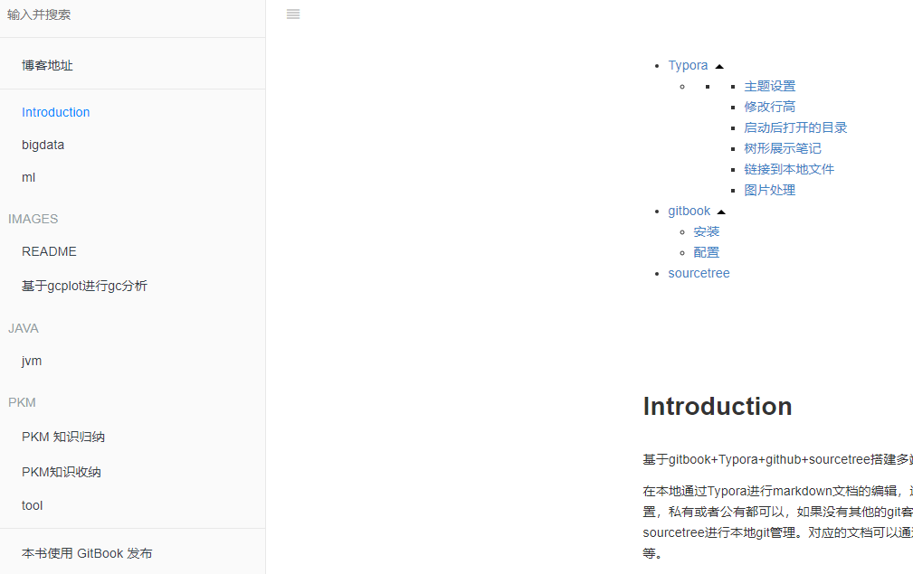

# Introduction

基于gitbook+Typora+github+sourcetree搭建自己的笔记系统

在本地通过Typora进行markdown文档的编辑，通过git进行管理，并将对应文档推送至github，github仓库可以随自己设置，私有或者公有都可以，如果没有其他的git客户端(git command除外)，例如基于IDEA vcs的git管理工具，那么可以使用sourcetree进行本地git管理。对应的文档可以通过gitbook进行发布，在网页端进行浏览，发布的时候还可以生成文档内目录等。

### Typora


[官网地址](http://support.typora.io/)

个人认为是目前比较好的跨平台markdown编辑器(在osx端有一个感觉更好用的Bear，更好看，搜索功能更强大，但是不支持windows，一些高级功能需要收费),扩展性比较强。关键是**支持按照目录层级显示md文件**

###### 主题设置

可以选择多种样式的主题

###### 修改行高

修改编辑器的默认行高: 在**偏好设置**->**外观**->**打开主题设置** 选择自己所用的具体主题的css文件

找到里面关于设置标题和ol等元素的css设置，修改margin-bottom 为自己认为合适的值

###### 启动后打开的目录

**偏好设置**->**通用**->启动选择 选择打开指定的目录,可以直接选择作为笔记文件夹的目录

###### 树形展示笔记

选择切换到文件树视图

###### 链接到本地文件

可以使用此功能，在笔记中互相链接，直接在链接地址中指定文件的相对位置

###### 图片处理


将图片保存在本地指定位置，并使用相对路径引用，将图片的本地位置设置为该笔记git项目的子目录，基于git进行管理，那么在其他地方同步该项目后，图片也能无缝对接显示

### gitbook

官网的介绍，一句话：**Document Everything!**

[官网地址](https://docs.gitbook.com/)

#### 安装

gitbook基于nodejs，需要先安装nodejs 可以先用`node -v`查看本机是否装有nodejs

gitbook安装

```shell
$ npm install gitbook-cli -g
```

查看是否安装成功

```shell
$ gitbook -V
```

命令行计入到作为笔记目录的位置,进行gitbook的初始化

```shell
$ gitbook init
```

会自动生成**README.md**和**SUMMARY.md**其中SUMMARY.md作为gitbook的目录文件(后面介绍怎么通过插件自动按照笔记文件目录生成里面的内容)

启动gitbook.默认端口是4000

```shell
$ gitbook serve 
```



#### 配置

在根目录创建book.json,配置项比较多，主要介绍其中一项重要配置**plugins**,插件配置:

```
"plugins": [
        "splitter","anchors",
        "favicon","chapter-fold","code",
        "expandable-chapters","todo","-lunr", 
        "-search", "search-pro","page-treeview","summary"
    ]
```

部分插件介绍:

1. **summary**,可以根据文件目录和文件自动生成SUMMARY的内容，也就是章节目录

2.  **chapter-fold**，导航目录折叠

3. **code**  为代码块添加复制按钮(但是我这貌似没起作用)

   其他插件可以参考:[gitbook插件整理](https://www.jianshu.com/p/427b8bb066e6)

> 添加完插件后需要 执行`gitbook install` 安装对应的插件

#### 注意

gitbook启动或者执行install后，会生成很多额外的文件,node_modules、_books等目录，需要将这些目录添加的.gitignore的文件中，让git不要跟踪他们

### sourcetree

比较简单的**git**客户端工具，支持mac和windows


可以直接使用git init 初始化一个目录进行git管理，然后在sourcetree打开，也可以直接clone一个远程项目，如果是本地初始化的项目需要添加自己的github仓库作为远程仓库。每次写完笔记后直接提交并推送到远程分支即可实现同步。

[官网地址](https://www.sourcetreeapp.com/)


