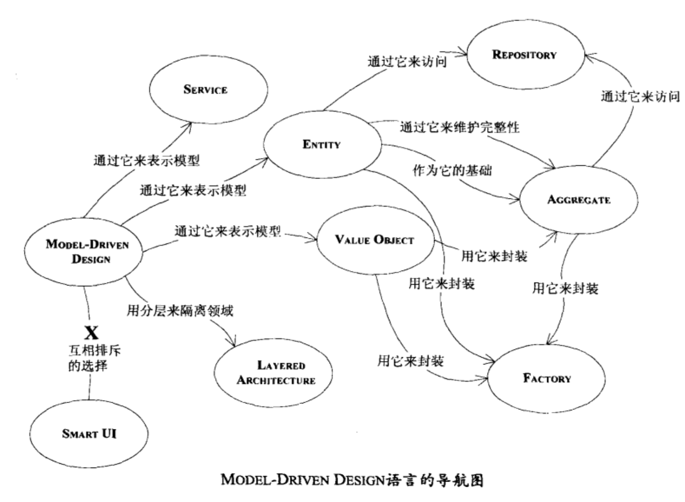
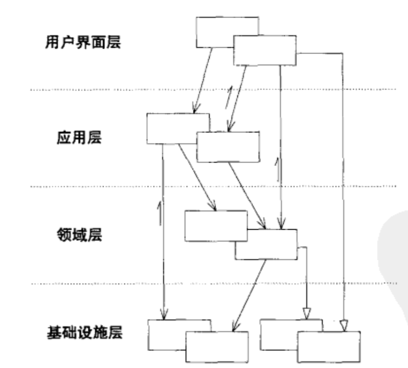
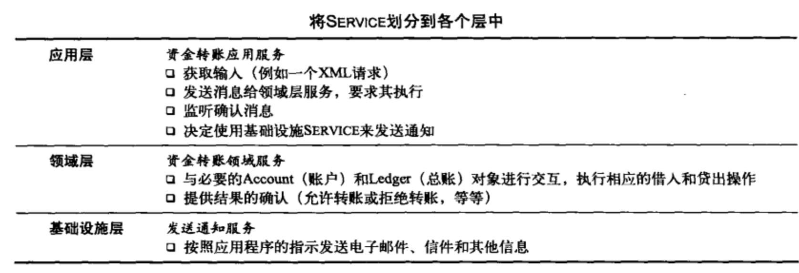

## 领域驱动设计学习笔记

### 领域模型发挥作用

有效建模的要素：

- 模型和实现的绑定 后续迭代需要一直维护模型
- 获得一种基于模型的语言
- 开发一个蕴含丰富知识的模型
- 提炼模型
- 头脑风暴和试验 语言、草图和头脑风暴活动，将团队的只是转化为有价值的模型

模型不应该仅仅是发现名词，**业务活动**和**规则**和**涉及的实体**都是领域的中心

领域模型和相应的设计可以用来保护和共享知识，更明确的设计优点：

将模型作为语言的中心，确保团队在所有交流活动和代码中坚持使用这种语言，通过尝试不同的表示方法来消除难点，然后重构代码，并对类、方法和模块重新命名。

讨论系统时要结合模型，使用模型的元素已经模型各元素之间的交互来大声的描述场景，并且按照模型允许的方式将各种概念集合到一起

如果连经验丰富的领域专家都不能理解模型，那模型一定有问题

文档和

#### 文档和图

文档应作为代码和口头交流的补充

核心思想：实现、设计和团队交流中使用同一个模型作为基础。

### 绑定模型和实现

严格按照基础模型来编写代码，能够使代码更好的表达设计模式，并且使模型更符合设计。项目过程中，开发人员需要不断与领域专家进行交流，这里的领域专家泛指对业务逻辑非常了解的人

软件系统的各部分设计应该忠实的反映领域模型，体现出二者之间明确的对应关系

**过程**语言不适合进行模型驱动设计

在软件开发过程中 **设计是无处不在的**，分析建模、设计和编程工作不应该完全分离。

模型驱动设计的两个重要要素：模型要支持有效的实现并抽象出关键的领域知识

#### 构造块

##### 分层设计

分层设计的基本原则，层中元素只依赖于本层和下层元素

处理基本业务规则的应该是领域层，而不是应用层，**基础设施层**不会发起领域层中的操作，处于领域层之下，不包含所服务的领域知识，常常以**service**的形式提供

SMARTUI 智能用户界面，

**简单项目不要使用DDD**

#### 软件中的模型

关联会增加软甲的复杂度，特别是**多对多**关联，关联应该限定为领域所偏向的方向

主要由标识定义的对象呗称作**ENTITY**,实体具有生命周期，形势和内容会变化，只有标识不变，职责和属性围绕标识变化，不会随着特殊属性变化。

value Object经常作为参数在在对象之间传递消息，他们通常是临时对象，再一次操作中创建，然后呗抛弃。value对象应该是**不可变的**，我们并不关心使用的是value对象的哪个实例。如果属性的值发生变化，应该使用另一个不同的valueObject,以下情况除外:

- value频繁改变
- 创建或删除对象开销很大
- 替换将打乱集群
- value的共享不多

**service**应该是无状态的，当领域中的某个重要的过程或转换操作不属于某个service的任何实例，应该在模型中添加service

区分领域层service和应用层service，应用层service，技术层service应该是没有任何业务意义的，领域层service只与领域层实体紧密相关。

> EG:银行应用程序可以吧交易进行转换并导出一个电子表格文件，这个导出就是一个应用层service，因为文件格式在银行领域中没有任何实际意义，而账户之间的转账属于领域层service，因为他包含业务规则，

领域service一般采用FACADE设计模式。

中等粒度的，无状态的service更容易被重用

#### module

module应该是低耦合高内聚的

module的重构应该与模型和代码一起进行。

#### aggregate

aggregate就是一组对象的集合，我们把它作为数据修改的单元，每个aggregate都有一个根和一个边界，规则

- 根aggregate具有全局标识，最终负责检查固定规则
- 边界内的entity具有本地标识
- 外部对象不能引用除根entity外的任何内部entity
- 只有根能通过数据库查询
- 内部对象可以保持对根的引用
- 删除操作必须一次删除边界内的所有对象

使用factory进行aggregate对象的创建

将创建复杂对象和实例和聚合的职责转移给另外一个单独的对象，对象本身在领域模型没有职责，提供一个封装所有复杂装配操作的接口，每个创建的方法都应该是**原子方法**，factory应该**抽象**为所需要的类型，而不是创建具体的类

> 不要在构造函数内部调用其他构造函数，需要使用factory

### 总结

把理解目标领域并吧学到的知识融合到软件中当做首要任务。