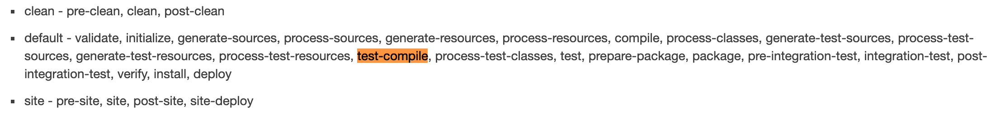

# Maven 学习笔记
[Maven Core – Plugin Bindings for Default Lifecycle Reference](http://maven.apache.org/ref/3.6.1/maven-core/default-bindings.html)
**查看插件提供的goal**
mvn help:describe -Dplugin=groupId:artifactId:version
### 内置指令
## 生命周期
[Maven – Introduction to the Build Lifecycle](http://maven.apache.org/guides/introduction/introduction-to-the-lifecycle.html)
由三个内置的主要生命周期组成 default、clean、sit
每个生命周期包含不同的stage，每一个stage按顺序执行 default的stage:
validate、compile、test、package、verify 、install、deploy 

再多脚本的项目中，会遍历执行每一个子项目的stage
目标通过绑定到各个build的stage上执行，如果一个执行步骤没有绑定目标将不会执行
将目标绑定到执行阶段的两种主要方式:

* 第一种也是最常见的方法是通过同名的POM元素<packaging>为您的项目设置包装。一些有效的包装价值是jar，war，ear和pom。如果未指定包装值，则默认为jar
* 第二种方法是在项目中配置插件。 插件是为Maven提供目标的工件
绑定示例:
``` xml
<plugin>
   <groupId>com.mycompany.example</groupId>
   <artifactId>display-maven-plugin</artifactId>
   <version>1.0</version>
   <executions>
     <execution>
       <phase>process-test-resources</phase>
       <goals>
         <goal>time</goal>
       </goals>
     </execution>
   </executions>
 </plugin>
```

## POM配置
[Maven – Introduction to the POM](http://maven.apache.org/guides/introduction/introduction-to-the-pom.html)
[Maven – POM Reference](http://maven.apache.org/pom.html)
所有的pom文件默认都继承自`The Super POM`
* **parent** 指定需要继承的父元素
::可以通过**<relativePath>../parent/pom.xml</relativePath>**指定父元素地址:: 
* 通过**modules**指定父元素包含的模块，支持相对路径
* 允许使用插值
### PROFILE
4个不同的配置文件位置:
pom.xml、%USER_HOME%/.m2/settings.xml、${maven.home}/conf/settings.xml、profiles.xml
指定profile的方式:
* 命令行 -P 参数
* 配置指定
``` xml
1. <settings>
3.   <activeProfiles>
4.     <activeProfile>profile-1</activeProfile>
5.   </activeProfiles>
7. </settings>
```
* 通过环境指定
``` xml
1. <profiles>
2.   <profile>
3.     <activation>
4.       <jdk>[1.3,1.6)</jdk>
5.     </activation>
1.     <activation>
2.       <os>
3.         <name>Windows XP</name>
4.         <family>Windows</family>
5.         <arch>x86</arch>
6.         <version>5.1.2600</version>
7.       </os>
8.     </activation>
7.   </profile>
8. </profiles>
```
## 标准目录布局
[Maven – Introduction to the Standard Directory Layout](http://maven.apache.org/guides/introduction/introduction-to-the-standard-directory-layout.html)
::mvn -pl module1,module3 somegoal:: 执行子目录的任务
## 依赖管理机制
[Maven – Introduction to the Dependency Mechanism](http://maven.apache.org/guides/introduction/introduction-to-dependency-mechanism.html)
 [dependency:analyze](http://maven.apache.org/plugins/maven-dependency-plugin/analyze-mojo.html) 
### 依赖范围
**compile** 默认范围
**provided** 运行时希望JDK或者运行容器提供的
**runtime** 编译不需要，在运行时依赖
**test** 仅用于测试的编译和执行
**system** 明确的提供jar 不会到仓库去找
**import** 
**子POM引用父POM的 时候 需要制定<type/>**
**Importing Dependencies** 引用其他项目的依赖
**exclusions** 排除项
### 依赖仓库
可以通过Mirror制定镜像
``` xml
1. <mirrors>
2.     <mirror>
3.       <id>UK</id>
4.       <name>UK Central</name>
5.       <url>http://uk.maven.org/maven2</url>
6.       <mirrorOf>central</mirrorOf>
7.     </mirror>
8.   </mirrors>
```

指定内部仓库
``` xml
1. <repositories>
2.     <repository>
3.       <id>my-internal-site</id>
4.       <url>http://myserver/repo</url>
5.     </repository>
6.   </repositories>
```
## 插件
[Maven – Guide to Configuring Plug-ins](http://maven.apache.org/guides/mini/guide-configuring-plugins.html)
插件通过**configuration**配置，每一个插件都是一个Mojo对象
插件必须制定Bind的生命周期才能执行
插件可以指定依赖项 和版本
可以使用`<inherited>false</inherited>`中断插件遗传

## 打包
打包添加 [manifest](http://maven.apache.org/shared/maven-archiver/index.html#class_manifest)  信息
## 配置
[Maven – Settings Reference](http://maven.apache.org/settings.html)
## 模板
```
1. mvnarchetype:generate\
2. -DgroupId=org.darebeat\
3. -DartifactId=HelloWorld\
4. -DarchetypeArtifactId=maven-archetype-quickstart\
5. -DarchetypeCatalog=local\
6. -DinteractiveMode=false
7. 
8. #创建Web应用
9. mvnarchetype:generate\
10. -DgroupId=org.darebeat\
11. -DartifactId=HelloWorld\
12. -DarchetypeArtifactId=maven-archetype-webapp\
13. -DarchetypeCatalog=local\
14. -DinteractiveMode=false
```
或者基于IDEA   创建maven项目是 选择archetype


