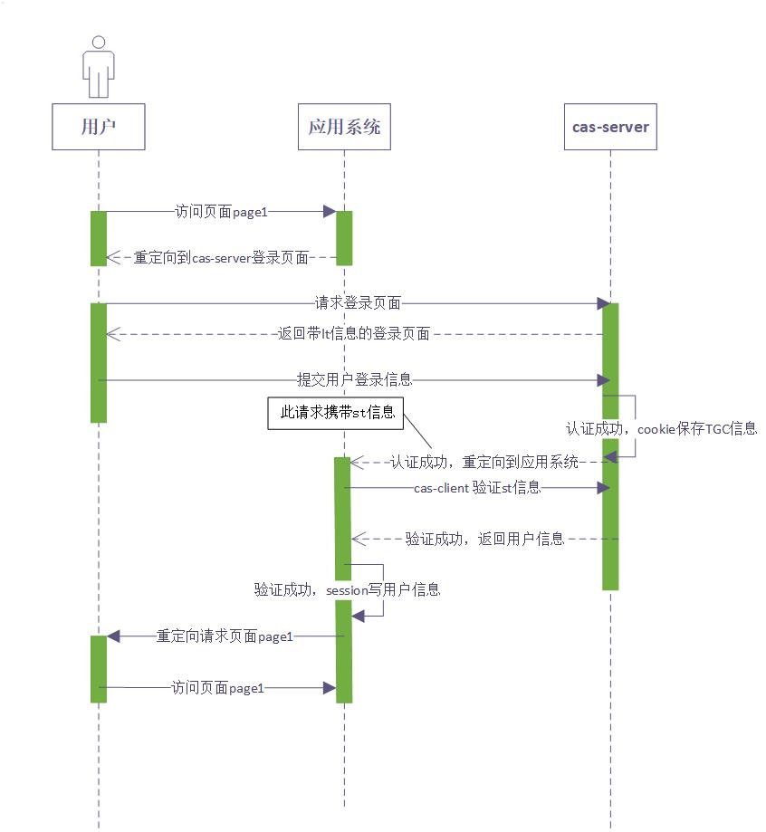

# 单点登录集成

## cas

比较标准的一个交互流程图:



基于redis实现session共享时的步骤、

1、对于完全不同域名的系统，cookie是无法跨域名共享的

2、cas方案，直接启用一个专业的用来登陆的域名（比如：cas.com）来供所有的系统登陆。

3、当业务系统（如b.com）被打开时，借助cas系统来登陆，过程如下：

cas登陆的全过程：

（1）、b.com打开时，发现自己未登陆 ----》 于是跳转到cas.com去登陆

（2）、cas.com登陆页面被打开，用户输入帐户/密码登陆成功

（3）、cas.com登陆成功，种cookie到cas.com域名下 -----------》把sessionid放入后台redis《ticket，sesssionid》---页面跳回b.com

```
String ticket = UUID.randomUUID().toString();
redisTemplate.opsForValue().set(ticket,request.getSession().getId(),20, TimeUnit.SECONDS);//一定要设置过期时间
CookieBasedSession.onNewSession(request,response);
response.sendRedirect(user.getBackurl()+"?ticket="+ticket);
```

（4）、b.com重新被打开，发现仍然是未登陆，但是有了一个ticket值

（5）、b.com用ticket值，到redis里查到sessionid，并做session同步 ------ 》种cookie给自己，页面原地重跳

（6）、b.com打开自己页面，此时有了cookie，后台校验登陆状态，成功

（7）整个过程交互，列图如下：


4、cas.com的登陆页面被打开时,如果此时cas.com本来就是登陆状态的,则自动返回生成ticket给业务系统

整个单点登陆的关键部位，是利用cas.com的cookie保持cas.com是登陆状态,此后任何第三个系统跳入,都将自动完成登陆过程

5,本示例中,使用了redis来做cas的服务接口,请根据工作情况,自行替换为合适的服务接口(主要是根据sessionid来判断用户是否已登陆)

6,为提高安全性,ticket应该使用过即作废(本例中,会用有效期机制)

```
public void doFilter(ServletRequest servletRequest,ServletResponse servletResponse, FilterChain filterChain)
        throws IOException, ServletException {
    HttpServletRequest request = (HttpServletRequest) servletRequest;
    MyRequestWrapper myRequestWrapper = new MyRequestWrapper(request,redisTemplate);
    //如果未登陆状态，进入下面逻辑
    String requestUrl = request.getServletPath();
    if (!"/toLogin".equals(requestUrl) && !requestUrl.startsWith("/login")  && !myRequestWrapper.isLogin()) {
        /**
         * ticket为空，或无对应sessionid为空
         * --- 表明不是自动登陆请求--直接强制到登陆页面
         */
        String ticket = request.getParameter("ticket");
        if (null == ticket || null == redisTemplate.opsForValue().get(ticket)){
            HttpServletResponse response = (HttpServletResponse)servletResponse;
            response.sendRedirect("http://cas.com:8090/toLogin?url="+request.getRequestURL().toString());
            return ;
        }
        /**
         * 是自动登陆请求，则种cookie值进去---本次请求是302重定向
         * 重定向后的下次请求，自带本cookie，将直接是登陆状态
         */
        myRequestWrapper.setSessionId((String) redisTemplate.opsForValue().get(ticket));
        myRequestWrapper.createSession();
        //种cookie
        CookieBasedSession.onNewSession(myRequestWrapper,(HttpServletResponse)servletResponse);
        //重定向自流转一次，原地跳转重向一次
        HttpServletResponse response = (HttpServletResponse)servletResponse;
        response.sendRedirect(request.getRequestURL().toString());
        return;
    }
    try {
        filterChain.doFilter(myRequestWrapper,servletResponse);
    } finally {
        myRequestWrapper.commitSession();
    }
}
public static void onNewSession(HttpServletRequest request, HttpServletResponse response) {
    HttpSession session = request.getSession();
    String sessionId = session.getId();
    Cookie cookie = new Cookie(COOKIE_NAME_SESSION, sessionId);
    cookie.setHttpOnly(true);
    cookie.setPath(request.getContextPath() + "/");
    cookie.setMaxAge(Integer.MAX_VALUE);
    response.addCookie(cookie);
}
```

## oauth2


[oauth2介绍](http://www.ruanyifeng.com/blog/2019/04/oauth_design.html)

[OAuth](http://en.wikipedia.org/wiki/OAuth)是一个关于授权（authorization）的开放网络标准，在全世界得到广泛应用，目前的版本是2.0版

*[OAuth2](http://www.baidu.com/link?url=pc9pzMjkVKukKSyOeEvjTtP2BOfR-PxOxlRztxnuIFKld2CrThM1xpwxG1HvE2wVS9VZmJv2EkBb2nCPILGoV9oEUuu2RnAJd-BTEVlNxcS): 解决的是不同的企业之间的登录，本质是授权*，如论坛与QQ

要能访问各种资源重点是要获取令牌（token），但根据令牌的获取方式不同，又会有四种授权方式

1. 授权码（authorization-code）
2. 隐藏式（implicit）
3. 密码式（password）
4. 客户端凭证（client credentials）

***\*授权码\*******\*：\****这是最常用的一种方式，指的是第三方应用先申请一个授权码，然后再用该码获取令牌，项目中用的就是这种

***\*隐藏式：\****允许直接向前端颁发令牌。这种方式没有授权码这个中间步骤，所以称为（授权码）"隐藏式"（implicit），一般应用于纯前端项目

***\*密码式：\****直接通过用户名和密码的方式申请令牌，这方式是最不安全的方式

***\*凭证式\*******\*：\****这种方式的令牌是针对第三方应用，而不是针对用户的，既某个第三方应用的所有用户共用一个令牌，一般用于没有前端的命令行应用

***\**\*授权码\*\**\**\**\*授权流程：\*\**\***


***\*第一步，A 网站提供一个链接，用户点击后就会跳转到 B 网站（权限验证系统）\****

http://b.com/oauth/authorize?

 response_type=code&

 client_id=CLIENT_ID&

 redirect_uri=CALLBACK_URL&

 scope=read

***\*第\*******\*二\*******\*步\*******\*，\*******\*用户跳转后，B 网站如果没有登录会要求用户登录，然后询问是否同意给予 A 网站授权。用户表示同意，这时 B 网站就会跳回redirect_uri\*******\*参数指定的网址，并附加授权码code\****

***\*h\****ttp://a.com/callback?code=AUTHORIZATION_CODE

***\*第三步，A 网站拿到授权码以后，在后端，向 B 网站请求令牌。\****

http://b.com/oauth/token?

 client_id=CLIENT_ID&

 client_secret=CLIENT_SECRET&

 grant_type=authorization_code&

 code=AUTHORIZATION_CODE&

 redirect_uri=CALLBACK_URL

上面 URL 中，client_id参数和client_secret参数用来让 B 确认 A 的身份（client_secret参数是保密的，因此只能在后端发请求），grant_type参数的值是AUTHORIZATION_CODE，表示采用的授权方式是授权码，code参数是上一步拿到的授权码，redirect_uri参数是令牌颁发后的回调网址。

***\*第四步，B 网站收到请求以后，就会颁发令牌。具体做法是向redirect_uri指定的网址，发送一段 JSON 数据。\****

{   

 "access_token":"ACCESS_TOKEN",

 "info":{...}

}

接下来用户就可以根据这个access_token来进行访问了，

如A网站拿着token，申请获取用户信息，B网站确认令牌无误，同意向A网站开放资源。

对于第三方网站来说 可分为3部分

1、申请code

2、申请token

3、带着token去请求资源（如：申请获取用户信息）

**伪代码**

服务端

```
@RequestMapping("authorize")
public Object authorize(Model model, HttpServletRequest request) throws OAuthSystemException, URISyntaxException {
    //构建OAuth请求
    OAuthAuthzRequest oAuthAuthzRequest = null;
    try {
        oAuthAuthzRequest = new OAuthAuthzRequest(request);

        // 根据传入的clientId 判断 客户端是否存在
        if(!authorizeService.checkClientId(oAuthAuthzRequest.getClientId())) {
            return HttpResponseBody.failResponse("客户端验证失败，如错误的client_id/client_secret");
        }

        // 判断用户是否登录
        Subject subject = SecurityUtils.getSubject();

        if(!subject.isAuthenticated()) {
            if(!login(subject, request)) {
                return new HttpResponseBody(ResponseCodeConstant.UN_LOGIN_ERROR, "没有登陆");
            }
        }
        String username = (String) subject.getPrincipal();

        //生成授权码
        String authorizationCode = null;

        String responseType = oAuthAuthzRequest.getParam(OAuth.OAUTH_RESPONSE_TYPE);
        if(responseType.equals(ResponseType.CODE.toString())) {
            OAuthIssuerImpl oAuthIssuer = new OAuthIssuerImpl(new MD5Generator());
            authorizationCode = oAuthIssuer.authorizationCode();
            shiroCacheUtil.addAuthCode(authorizationCode, username);
        }

        Map<String, Object> data = new HashMap<>();
        data.put(SsoConstants.AUTH_CODE, authorizationCode);
        return HttpResponseBody.successResponse("ok", data);

    } catch(OAuthProblemException e) {
        return HttpResponseBody.failResponse(e.getMessage());
    }
}
@RequestMapping("/accessToken")
public HttpEntity token(HttpServletRequest request) throws OAuthSystemException {
    try {
        // 构建Oauth请求
        OAuthTokenRequest oAuthTokenRequest = new OAuthTokenRequest(request);
        
        //检查提交的客户端id是否正确
        if(!authorizeService.checkClientId(oAuthTokenRequest.getClientId())) {
            OAuthResponse response = OAuthASResponse.errorResponse(HttpServletResponse.SC_BAD_REQUEST)
                    .setError(OAuthError.TokenResponse.INVALID_CLIENT)
                    .setErrorDescription("客户端验证失败，如错误的client_id/client_secret")
                    .buildJSONMessage();
            return new ResponseEntity<>(response.getBody(), HttpStatus.valueOf(response.getResponseStatus()));
        }
        
        // 检查客户端安全Key是否正确
        if(!authorizeService.checkClientSecret(oAuthTokenRequest.getClientSecret())){
            OAuthResponse response = OAuthASResponse.errorResponse(HttpServletResponse.SC_UNAUTHORIZED)
                    .setError(OAuthError.TokenResponse.UNAUTHORIZED_CLIENT)
                    .setErrorDescription("客户端验证失败，如错误的client_id/client_secret")
                    .buildJSONMessage();
            return new ResponseEntity<>(response.getBody(), HttpStatus.valueOf(response.getResponseStatus()));
        }
        
        String authCode = oAuthTokenRequest.getParam(OAuth.OAUTH_CODE);
        
        // 检查验证类型，此处只检查AUTHORIZATION类型，其他的还有PASSWORD或者REFRESH_TOKEN
        if(oAuthTokenRequest.getParam(OAuth.OAUTH_GRANT_TYPE).equals(GrantType.AUTHORIZATION_CODE.toString())){
            if(!shiroCacheUtil.checkAuthCode(authCode)){
                OAuthResponse response = OAuthASResponse.errorResponse(HttpServletResponse.SC_BAD_REQUEST)
                        .setError(OAuthError.TokenResponse.INVALID_GRANT)
                        .setErrorDescription("error grant code")
                        .buildJSONMessage();
                return new ResponseEntity<>(response.getBody(), HttpStatus.valueOf(response.getResponseStatus()));
            }
        }

        //生成Access Token
        OAuthIssuer issuer = new OAuthIssuerImpl(new MD5Generator());
        final String accessToken  = issuer.accessToken();
        shiroCacheUtil.addAccessToken(accessToken, shiroCacheUtil.getUsernameByAuthCode(authCode));
        logger.info("accessToken generated : {}", accessToken);

        //需要保存clientSessionId和clientId的关系到redis，便于在Logout时通知系统logout
        String clientSessionId = request.getParameter("sid");
        //System.out.println("clientSessionId = " + clientSessionId);
        String clientId = oAuthTokenRequest.getClientId();
        //System.out.println("clientId = " + clientId);
        redisTemplate.opsForHash().put(RedisKey.CLIENT_SESSIONS, clientSessionId, clientId);

        // 生成OAuth响应
        OAuthResponse response = OAuthASResponse.tokenResponse(HttpServletResponse.SC_OK)
                .setAccessToken(accessToken).setExpiresIn(String.valueOf(authorizeService.getExpireIn()))
                .buildJSONMessage();
        
        return new ResponseEntity<>(response.getBody(), HttpStatus.valueOf(response.getResponseStatus()));
    } catch(OAuthProblemException e) {
        e.printStackTrace();
            OAuthResponse res = OAuthASResponse.errorResponse(HttpServletResponse.SC_BAD_REQUEST).error(e).buildBodyMessage();
        return new ResponseEntity<>(res.getBody(), HttpStatus.valueOf(res.getResponseStatus()));
    }
}
@RequestMapping("/userInfo")
public HttpEntity userInfo(HttpServletRequest request) throws OAuthSystemException {
    try {
        
        //构建OAuth资源请求
        OAuthAccessResourceRequest oauthRequest = new OAuthAccessResourceRequest(request, ParameterStyle.QUERY);
        //获取Access Token
        String accessToken = oauthRequest.getAccessToken();

        //验证Access Token
        if (!shiroCacheUtil.checkAccessToken(accessToken)) {
            // 如果不存在/过期了，返回未验证错误，需重新验证
            OAuthResponse oauthResponse = OAuthRSResponse
                    .errorResponse(HttpServletResponse.SC_UNAUTHORIZED)
                    .setRealm("fxb")
                    .setError(OAuthError.ResourceResponse.INVALID_TOKEN)
                    .buildHeaderMessage();
            
            HttpHeaders headers = new HttpHeaders();
            headers.add(OAuth.HeaderType.WWW_AUTHENTICATE, oauthResponse.getHeader(OAuth.HeaderType.WWW_AUTHENTICATE));
            return new ResponseEntity(headers, HttpStatus.UNAUTHORIZED);
        }
        //返回用户名
        String username = shiroCacheUtil.getUsernameByAccessToken(accessToken);
        SysUser user = userService.selectByAccount(username);
        return new ResponseEntity<>(user, HttpStatus.OK);
    } catch (OAuthProblemException e) {
        //检查是否设置了错误码
        String errorCode = e.getError();
        if (OAuthUtils.isEmpty(errorCode)) {
            OAuthResponse oauthResponse = OAuthRSResponse
                    .errorResponse(HttpServletResponse.SC_UNAUTHORIZED)
                    .setRealm("fxb")
                    .buildHeaderMessage();
            
            HttpHeaders headers = new HttpHeaders();
            headers.add(OAuth.HeaderType.WWW_AUTHENTICATE, oauthResponse.getHeader(OAuth.HeaderType.WWW_AUTHENTICATE));
            return new ResponseEntity(headers, HttpStatus.UNAUTHORIZED);
        }
        
        OAuthResponse oauthResponse = OAuthRSResponse
                .errorResponse(HttpServletResponse.SC_UNAUTHORIZED)
                .setRealm("fxb")
                .setError(e.getError())
                .setErrorDescription(e.getDescription())
                .setErrorUri(e.getUri())
                .buildHeaderMessage();
        
        HttpHeaders headers = new HttpHeaders();
        headers.add(OAuth.HeaderType.WWW_AUTHENTICATE, oauthResponse.getHeader(OAuth.HeaderType.WWW_AUTHENTICATE));
        return new ResponseEntity(HttpStatus.BAD_REQUEST);
    }
}
```

客户端

```
private String extractUsername(String code) {
    OAuthClient oAuthClient = new OAuthClient(new URLConnectionClient());
    try {
        OAuthClientRequest accessTokenRequest = OAuthClientRequest.tokenLocation(accessTokenUrl)
                .setGrantType(GrantType.AUTHORIZATION_CODE)
                .setClientId(clientId)
                .setClientSecret(clientSecret)
                .setCode(code)
                .setRedirectURI(redirectUrl)
                .setParameter("sid", SecurityUtils.getSubject().getSession().getId().toString())
                .buildQueryMessage();
        OAuthAccessTokenResponse oAuthResponse = oAuthClient.accessToken(accessTokenRequest, OAuth.HttpMethod.POST);
        String accessToken = oAuthResponse.getAccessToken();

        //拿用户信息
        OAuthClientRequest userInfoRequest = new OAuthBearerClientRequest(userInfoUrl)
                .setAccessToken(accessToken).buildQueryMessage();

        OAuthResourceResponse resourceResponse = oAuthClient.resource(userInfoRequest, OAuth.HttpMethod.GET, OAuthResourceResponse.class);

        String userJson = resourceResponse.getBody();
        SysUser user = JsonUtils.json2Obj(userJson, SysUser.class);
        this.setResource(user, accessToken);
        return user.getUserName();
    } catch(OAuthSystemException e) {
        e.printStackTrace();
        throw new  RuntimeException(e);
    } catch(OAuthProblemException e) {
        e.printStackTrace();
        throw new BusinessException(ResponseCodeConstant.UN_LOGIN_ERROR, "没有登录");
    }
}
<dependency>
   <groupId>org.apache.oltu.oauth2</groupId>
   <artifactId>org.apache.oltu.oauth2.authzserver</artifactId>
   <version>1.0.2</version>
</dependency>
<dependency>
   <groupId>org.apache.oltu.oauth2</groupId>
   <artifactId>org.apache.oltu.oauth2.resourceserver</artifactId>
   <version>1.0.2</version>
</dependency>
```