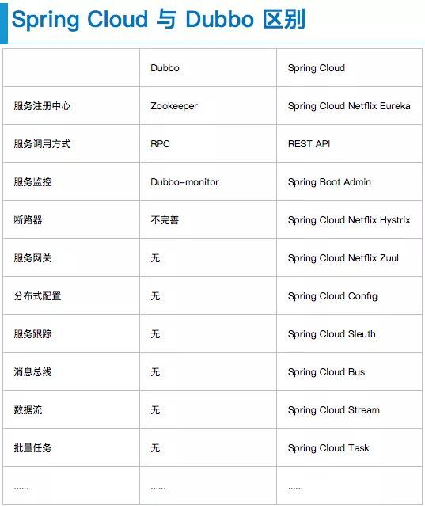

# 微服务选型

目前，大部分公司的一个技术路线:

其中在服务话体系这块,主要有两个拿来作比较的方案:dubbo方案和spring cloud生态,下面是其早期的一个生态对比，但是目前已经有部分同，Spring Cloud 的 Eureka 停更了，Hystrix 闭源了。阿里另外开源了 Nacos、Sentinel，可以作为Dubbo的生态

spring cloud组件：

dubbo架构:

## 其他服务化方案

- Nacos+Dubbo

- Etcd3+Dubbo

- Consul+Dubbo

- SpringCloud全家桶

- Vert.X

- Etcd+GRPC

- 腾讯Tars

  ### spring cloud alibaba

  主要的组件对比:

  

  包含的组件:

  

  

## service mesh

## 参考

[dubbo底层原理](https://baijiahao.baidu.com/s?id=1645744285641737459&wfr=spider&for=pc)

[阿里巴巴不为什么不用zookeeper做服务发现](https://yq.aliyun.com/articles/599997)

[CAP和BASE](https://yq.aliyun.com/articles/692238)

[阿里巴巴spring cloud alibaba介绍](https://zhuanlan.zhihu.com/p/98874444)

[spring cloud使用](https://sq.163yun.com/blog/article/168136513065467904)

