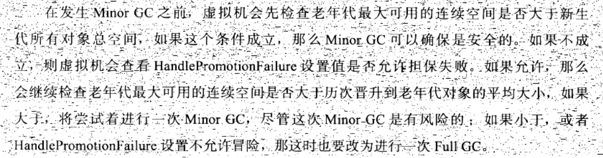

# JVM内存调优
## 启动参数
java -Djava.util.logging.config.file=/service/appservers/tomcat-columbiahk-mobile2/conf/logging.properties -Djava.util.logging.manager=org.apache.juli.ClassLoaderLogManager -server -Xms1g -Xmx1g -XX:PermSize=256m -XX:MaxPermSize=256m -Duser.timezone=Asia/shanghai -Djava.awt.headless=true -Dlog_path=/service/logs/software/tomcat/production/columbiahk/mobile -XX:+HeapDumpOnOutOfMemoryError -XX:HeapDumpPath=/service/logs/software/tomcat/columbia/columbia-mobile-pro-heapDump.log -Dcom.sun.management.jmxremote.authenticate=false -Dcom.sun.management.jmxremote.ssl=false -Djava.rmi.server.hostname=10.22.1.21 -Djava.endorsed.dirs=/service/appservers/tomcat-columbiahk-mobile2/endorsed -classpath /service/appservers/tomcat-columbiahk-mobile2/bin/bootstrap.jar:/service/appservers/tomcat-columbiahk-mobile2/bin/tomcat-juli.jar -Dcatalina.base=/service/appservers/tomcat-columbiahk-mobile2 -Dcatalina.home=/service/appservers/tomcat-columbiahk-mobile2 -Djava.io.tmpdir=/service/appservers/tomcat-columbiahk-mobile2/temp org.apache.catalina.startup.Bootstrap start
## 内存模型
* 程序计数器:线程私有
* 虚拟机栈:方法执行的内存模型，存放方法的局部变量表、操作数栈等，线程私有 -Xss 设置大小::分为StackOverflowError(线程请求栈深度大于虚拟机允许的最大深度)和OOM(内存空间不足)::
* 本地方法栈 同虚拟机栈
* java堆 几乎所有的对象都在堆上分配  -Xmx和-Xms调整大小，-XX:-HeapDumpOnOutOfMemoryError 输出oom异常日志
堆划分为 新生代young和老年代Tenured Gen ::在垃圾收集算法为复制算法时，新生代划分为1个Eden Space和两个Survivor Space:: 
* 方法区:存放类型新、常量、静态变量等，**永生代** -XXMaxPermSize 调整大小
* 运行时常量池：方法区的一部分
* 直接内存
-Xmn 新生代内存空间大小
-XX:Su
## 分配策略
* 对象优先在EDEN区分配，当EDEN区不够时，会进行一次MInor GC **-XX:-PrintGCDetails**打印GC日志
* 大对象直接进入老年代 -XX:PretenureSizeThreshold 参数设置 默认为**3M**
* 长期存活的对象进入老年代.经过一次Minor gc  就加1岁，-XX:MaxTenuringThreshold=n 可以设置阀值 默认为15岁进入老年代
* 动态对象年龄判断，在survivor中，相同年龄对象的大小综合大于survivor空间的一半，大于该年龄的对象可以直接进入老年代
* 空间分配担保

### full gc时间
* 分配担保不足时
* System.gc()
* old/Tenured 空间不足
* perm/metaspace 空间不足
* CMS GC时出现promotion failed和concurrent mode failure
另一个问题是，何时会抛出OutOfMemoryException，并不是内存被耗空的时候才抛出
* JVM98%的时间都花费在内存回收
* 每次回收的内存小于2%
## 分析工具
### 日志输出
-verbose:gc
**-Xloggc:../logs/tomcat_gc.log**
-XX:+PrintGC 输出GC日志
-XX:+PrintGCDetails 输出GC的详细日志
-XX:+PrintGCTimeStamps 输出GC的时间戳（以基准时间的形式）
-XX:+PrintGCDateStamps 输出GC的时间戳（以日期的形式，如 2013-05-04T21:53:59.234+0800）
-XX:+PrintHeapAtGC 在进行GC的前后打印出堆的信息
-Xloggc:../logs/gc.log 日志文件的输出路径
### GCeasy
部署 https://gceasy.io/index.jsp#features
1. 将GC日志文件gc.txt压缩成zip；
2. 访问https://gceasy.io/index.jsp#features，完全在线，上传zip；
3. Analyze，多等一会，将会展示数据和图表；
### GCPlot

###  JClarity
部署（付费）https://www.jclarity.com/censum/
1. 在官网选择试用，填写信息（邮箱），将会收到下载地址和uuid；
2. 在下载页输入邮箱、uuid、操作系统，点击submit，将会收到包含licence key的邮件，浏览器将下载安装包；
3. （macOS下载tgz）双击tgz文件，将解压后目录下的文件移动到应用程序目录下，在启动台点击icon运行；
4. 首次运行输入licence key；
5. 点击Analyse a GC Log；上传GC日志文件gc.txt；
6. 将会展示分析结果和建议（ANALYTICS，如👇图所示）、图表和数据（GRAPHS AND DATA）；
### Eclipse memory analyzer
### **GcViewer**
### gchisto
[https://java.net/projects/gchisto](https://java.net/projects/gchisto)
### GcLogViewer
### HPjmeter
### garbagecat
### jvisualvm
### spotify

## 分析内容