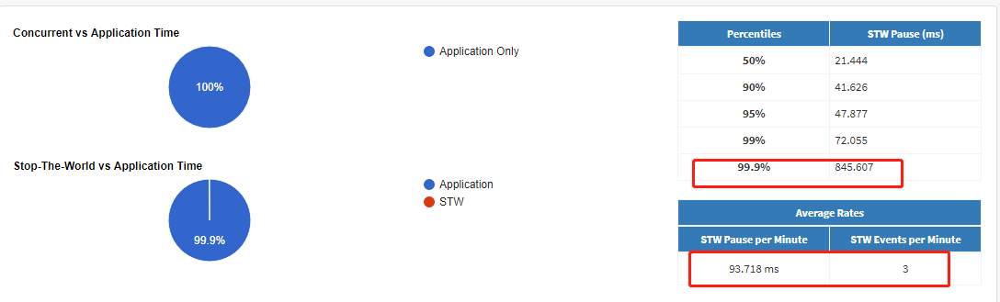

## java程序基于jvm进行内存问题排查

排查主要分两块，**heapdump分析**和**gc log**分析，heapdump是java进程在某个时刻的内存快照，而gcl log是Java程序运行过程中的gc详细日志。需要将两部分配合使用。

### heapdump数据采集

#### 使用jvm参数

在启动项中增加jvm参数 ` -XX:+HeapDumpOnOutOfMemoryError `，当应用抛出OutofmemoryError的时候，会自动生成dump文件。(之前看过一篇文章说，jvm在内存使用率达到98%的时候就会有相关异常，剩下的2%内存用于进行heapdump的生成与保存)。

但是这个方法以前遇到过一个情况，当程序内存不足时，抛出了outofmemoryError,但是程序并不会down，而是大部分请求都非常缓慢，程序会提醒heap内存不足，但并不会生成heapdump文件。

#### 使用jdk自带工具

如果有时间可以看看**深入理解java虚拟机**第4章，里面对这些工具都进行了介绍

##### jmap

` jmap -dump:live,format=b,file=heap-dump.bin <pid>`

其中live参数表示只dump存货的对象

##### jvisualvm

加载对应的本地或者远程进程后，右键对应进程，选择堆dump，确认后即可在应用的机器上生成对应的dump文件

> 在linux系统下，通过kiii -3 命令也能让虚拟机生成dump文件

### 分析heapdump

#### jhat

jdk内置命令行工具，比较简陋，而且一般heapdump的分析都不会再服务器进行，而且download到本地后进行。download到本地后可以基于MAT或者IBM HA进行，重点介绍基于mat的,使用方式

```shell
jhat hprof文件
```

#### jvisualvm

jdk自带的jvm分析工具

通过装入对应的文件，即可开始分析


同时，如图还可以直接监视本地jvm线程，可以查看到JVM的详细信息、线程、CPU、内存的使用情况等


还可以通过JMX和jstatd查看远程服务器上的jvm信息

##### JMX

JMX需要增加jvm参数

```shell
JAVA_OPTS=-Dcom.sun.management.jmxremote.port=8999 -Dcom.sun.management.jmxremote.ssl=false -Dcom.sun.management.jmxremote.authenticate=false

-Dcom.sun.management.jmxremote.port=8999，是jmxremote使用的端口号，可修改。
-Dcom.sun.management.jmxremote.authenticate=false，表示不需要鉴权，主机+端口号即可监控。
```

**需要鉴权的配置**

```shell
set JMX_REMOTE_CONFIG=-Dcom.sun.management.jmxremote -Dcom.sun.management.jmxremote.port=8999 -Dcom.sun.management.jmxremote.ssl=false -Dcom.sun.management.jmxremote.authenticate=true -Dcom.sun.management.jmxremote.password.file=../conf/jmxremote.password -Dcom.sun.management.jmxremote.access.file=../conf/jmxremote.access  
set CATALINA_OPTS=%CATALINA_OPTS% %JMX_REMOTE_CONFIG%
```

这一块和jstatd可以参考  https://www.cnblogs.com/intsmaze/p/9458598.html 

#### mat

Eclipse Memory Analyzer

[官网地址](https://www.eclipse.org/mat/)


使用mat的一些技巧

- mat导入的文件必须是hprof格式的，如果dump下来的文件不是以这个格式的，直接修改文件名后缀即可

- 内存数据的单位默认是byte，可以在windows->proference->memory analyzer中进行调整

- 分析比较大的heapdump时，可以通过修改安装文件夹下MemoryAnalyzer.ini文件，增加-Xmx参数增加堆内存

  ##### 概念介绍

  在进行分析之前需要了解MAT中使用到的一些概念

**shallow heap和retained heap**

shallow heap是对象自身占用的内存大小，不包括它引用的对象。 retained heap=当前对象大小+当前对象可直接或间接引用到的对象的大小总和(不包括被其他对象引用到的对象，例如A对象引用了B和C对象,但是C对象还被D对象引用了，D与A无关或者为GC root对象则A的retained heap不包括C对象大小)

 **Retained set**

对于某个对象X来说，它的Retained set指的是——如果X被垃圾收集器回收了，那么这个集合中的对象都会被回收，同理，如果X没有被垃圾收集器回收，那么这个集合中的对象都不会被回收     

**Unreachable**

 Unreachable指的是可以被垃圾回收器回收的对象，但是由于没有GC发生，所以没有释放，这时抓的内存使用中的Unreachable就是这些对象 

##### mat分析结果

**overview**

可以看到块中的内存使用量，需要特别注意的是，size是当前可以找到引用的内存对象总大小，后面还有个unreachable Objects histogram，这里是不可达对象的内存总大小

**Histogram**

可以一用对象的数量、内存情况统计，下面的total就等于overview的size


**dominator tree**

支配: 如果在对象图中，从gc root或者x上游的一个节点开始遍历，x是y的必经节点，那么就可以说x支配了y（**dominate**）

通过支配树可以很方便得识别出哪些对象占用了大量的内存，并可以看到它们之间的依赖关系

**top consumers**

可以看做是dominator tree的分析结果，图标的形式展示了，占用内存较大的对象，并有百分比，以及他们的包、类加载器

**duplicate**

重复的类，可以通过该tab查看是否过多加载了一些重复的类

**leak suspects**

名字就是`泄密者`，是mat给出的一些可能存在内存泄漏的建议，但是这儿也是基于dominator分析的结果，取的也是占用内存较高的对象，可以作为一个参考

**top component** 

从类加载器的角度分析，内存快照的对象内存情况

## gc分析

### gc日志的收集

[jvm参数配置参考地址](https://www.oracle.com/technetwork/java/javase/tech/vmoptions-jsp-140102.html)

gcplot推荐的gc日志收集jvm参数:

```java
-XX:+PrintGCDetails -XX:+PrintTenuringDistribution -XX:+PrintGCTimeStamps -XX:+PrintGCDateStamps -Xloggc:/path/to/file 
```

主要的参数项意义  Xloggc :指定gc日志的文件(1.8以后 推荐使用  -verbose )PrintGCDetails :打印回收详情, PrintGCTimeStamps :打印gc的时间戳， PrintHeapAtGC：打印gc的次数和gc前后的heap内存使用情况

> 有一点需要注意的是，如果直接指定gc日式文件，在程序重启后，之前记录的文件会被覆盖，导致内容丢失，在某些版本的Java中，可以在文件名中加上**％t**，这样文件名会带上当前时间格式字符串，或者**％p**带上进程ID，另外一种解决方案是基于内置**GC日志文件轮换** . `-XX：+ UseGCLogFileRotation -XX：NumberOfGCLogFiles = 10 -XX：GCLogFileSize = 10M` ， 通过最多10个文件，'.0'，'.1'... '.9'将被添加到您在Xloggc中给出的文件名中。 .0将是第一个，在达到.9之后，它将取代.0并以循环方式继续 

### 日志分析

#### gcplot的安装

[GCPLOT官网](https://gcplot.com/)

建议基于docker进行啊安装，非常方便

1. 安装docker 可以参见网上或者官网的教程
2. 终端运行命令 docker run -d -p 80:80 gcplot/gcplot
3. 在浏览器访问地址 http://127.0.0.1 用户名和密码均为admin

#### 使用

登陆后访问: General ->Upload gc log->选择文件->点击uplioad上传按钮。待上传成功后访问:Analysis Groups->Files-><你上传的日志文件> 就可以看到具体的分析信息


### gc分析

在该页面有多个tab，从多个维度分析了具体的gc信息主要介绍几个

#### Pause

包含新生代、老年代、方法区所的gc暂停所有信息，从STOP-THE-WORLD和 Concurrent 维度进行分析

重点可以看平均每次STW的时间和高消耗时间所占用的比例



>  GC暂停的Log10（x），这对于查看低值的分布非常有帮助 

#### Generations

这是有关每个GC代的最详细的统计信息。有一些表，其中包含按代划分的总计，已占用的大小，以及累积的STW暂停图，最后还有大量统计信息，例如总计，最小/最大，平均暂停时间，事件之间的平均间隔等。

> 重点可以看看Full gc的次数、FULL GC间隔的时间、fullgc最小间隔时间以及总共STW的时间，


另外堆内存，及各代平均使用大小，可以作为程序内存分配的参考


#### tenuring stats

统计对象年龄的分布情况，并且会根据相关数据给出一定的建议，需要在jvm参数中加入PrintTenuringDistribution统计相关信息

#### system

分别统计内核CPU时间和进程内用户代码所花费的CPU时间(也就值gc的实际时间)

memory

分别统计 年轻代(yong)、老年代(tenured)、方法区(metaspace/perm)在gc前后的内存使用数据，并且还有数据经过EMA算法处理，能够看到相关数据比较平滑的曲线(尽量排除噪音数据的影响)

并且还有内存的提升速率和分配速率曲线

> 通过full gc的频率以及每次full gc后老年代可用内存的对比，基本上可以确定是否有内存泄漏

#### 分析日志概要

参考:
	[GC专家系列1：理解Java垃圾回收](https://segmentfault.com/a/1190000004233812)

​	《深入理解Java虚拟机》书籍

​	