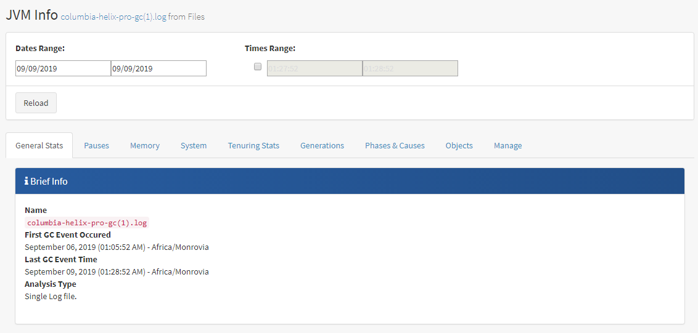

## 基于gcplot进行gc日志分析

### gcplot的安装

[GCPLOT官网](https://gcplot.com/)

建议基于docker进行啊安装，非常方便

1. 安装docker 可以参见网上或者官网的教程
2. 终端运行命令 docker run -d -p 80:80 gcplot/gcplot
3. 在浏览器访问地址 http://127.0.0.1 用户名和密码均为admin

### 使用

登陆后访问: General ->Upload gc log->选择文件->点击uplioad上传按钮。待上传成功后访问:Analysis Groups->Files-><你上传的日志文件> 就可以看到具体的分析信息

### gc分析

在该页面有多个tab，从多个维度分析了具体的gc信息主要介绍几个

#### Pause

包含新生代、老年代、方法区所的gc暂停所有信息，从STOP-THE-WORLD和 Concurrent 维度进行分析

重点可以看平均每次STW的时间和高消耗时间所占用的比例

>  GC暂停的Log10（x），这对于查看低值的分布非常有帮助 

#### Generations

这是有关每个GC代的最详细的统计信息。有一些表，其中包含按代划分的总计，已占用的大小，以及累积的STW暂停图，最后还有大量统计信息，例如总计，最小/最大，平均暂停时间，事件之间的平均间隔等。

> 重点可以看看Full gc的次数。已经总共暂停的时间，间隔的时间 最小间隔时间等

#### 分析日志概要

参考:
	[GC专家系列1：理解Java垃圾回收](https://segmentfault.com/a/1190000004233812)

​	《深入理解Java虚拟机》书籍

​	