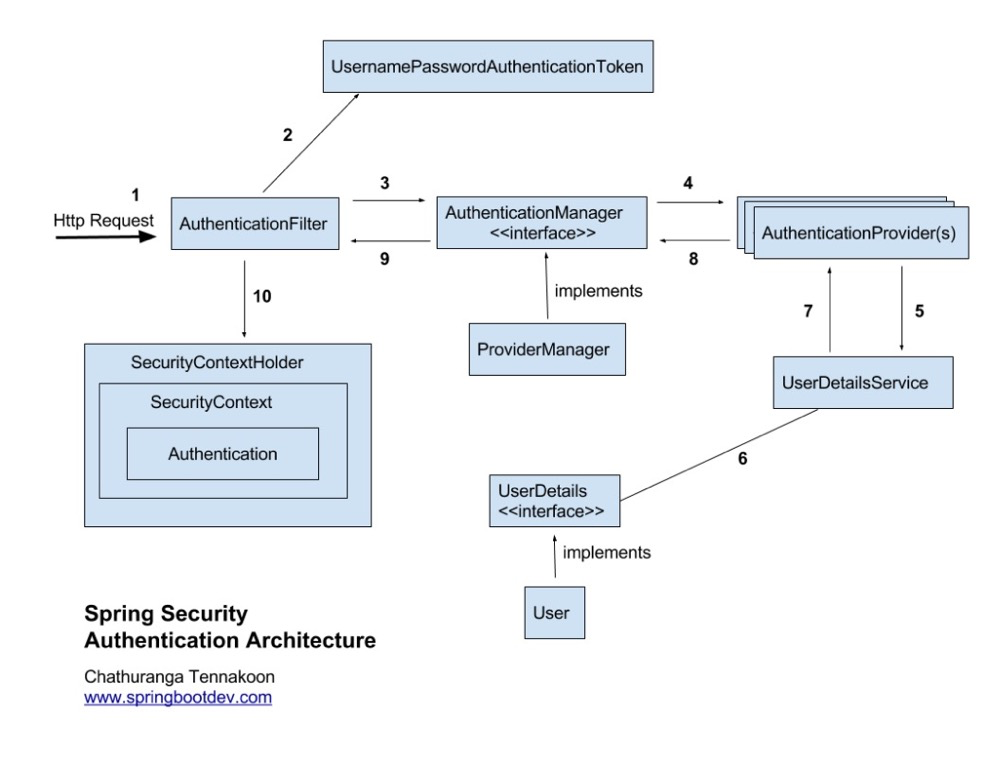
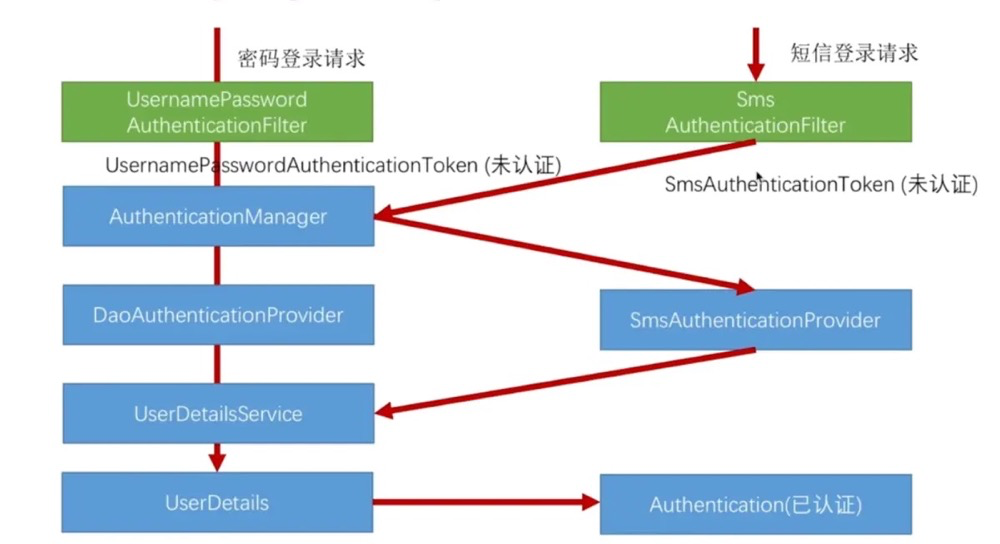

# Spring security参考

## Core

### 请求流程

### 架构

#### 核心概念

**SecurityContextHolder** 应用的security配置信息存放处

**Authentication** 认证配置信息

**UserDetails**用户实心的抽象，与应用自己的用户进行适配

**UserDetailsService**spring security加载用户信息的最常用方法 它不进行用户认证，认证工作由`AuthenticationManager`完成，需要自定义身份验证时,直接提供自己实现的AuthenticationProvider

**GrantedAuthority**授权信息,一般主要是组或者角色,资源权限由其他部分完成

主要参与认证过程的是`UsernamePasswordAuthenticationToken`、`AuthenticationManager`

##### web认证

`AbstractSecurityInterceptor` 授权服务的主要提供者

`ExceptionTranslationFilter` 负责检测抛出的任何Spring Security异常，返回错误代码403（如果主体已通过身份验证，因此仅缺少足够的访问权限-按照上面的第七步），或者启动AuthenticationEntryPoint

**Authentication Mechanism**收集了身份验证详细信息，便会建立一个身份验证“请求”对象，然后将其呈现给AuthenticationManager。身份验证机制收到完全填充的Authentication对象后，它将认为请求有效，将Authentication放入SecurityContextHolder

`AuthenticationEntryPoint` 进行身份验证的入口,跳到登录页或者返回http status

`SecurityContextPersistenceFilter`它默认将上下文存储为HTTP请求之间的HttpSession属性。 它将每个请求的上下文还原到SecurityContextHolder

`AccessDecisionManager` 访问控制的决定对象

`AbstractSecurityInterceptor`安全对象的拦截器

**secure object**指方法调用、页面请求等

> 验证方式:将安全对象，当前的身份验证和配置属性提交到AccessDecisionManager以进行授权决策

**ConfigAttribute**配置属性，AbstractSecurityInterceptor使用的特殊字符串，类似<intercept-url pattern ='/ secure / **'access ='ROLE_A，ROLE_B'/>的内容时，这表示配置属性ROLE_A和ROLE_B适用于Web请求匹配 给定的模式。 在实践中，使用默认的AccessDecisionManager配置，这意味着任何具有与这两个属性之一匹配的GrantedAuthority的人都将被允许访问。 但是严格来说，它们只是属性，其解释取决于AccessDecisionManager的实现

#### 核心服务

`AuthenticationManager`主要的实现是`ProviderManager`

`DaoAuthenticationProvider`AuthenticationProvider的简单实现

`UserDetailsService`和`UserDetails` `PasswordEncoder`

### WEB

web程序中使用filterChain进行处理，其中主要采用`FilterChainProxy`

filter顺序:

1. ChannelProcessingFilter，因为它可能需要重定向到其他协议

2. **SecurityContextPersistenceFilter**，因此可以在Web请求开始时在SecurityContextHolder中设置SecurityContext，并且可以在Web请求结束时将对SecurityContext的任何更改复制到HttpSession（准备与下一个Web请求一起使用），将存储和修改工作委托给**SecurityContextRepository**，默认实现是`HttpSessionSecurityContextRepository`

3. ConcurrentSessionFilter，因为它使用了SecurityContextHolder功能，并且需要更新SessionRegistry以反映来自主体的持续请求

4. 身份验证处理机制-**UsernamePasswordAuthenticationFilter**，CasAuthenticationFilter，BasicAuthenticationFilter等-以便可以将SecurityContextHolder修改为包含有效的身份验证请求令牌如果要使用SecurityContextHolderAwareRequestFilter将Spring Security感知的HttpServletRequestWrapper安装到servlet容器中

5. JaasApiIntegrationFilter，如果JasAuthenticationToken在SecurityContextHolder中，则它将在JaasAuthenticationToken中将FilterChain作为主题处理

6. RememberMeAuthenticationFilter，因此，如果没有较早的身份验证处理机制更新SecurityContextHolder，并且请求显示一个cookie来启用“记住我”服务，则会在此处放置一个合适的记住的Authentication对象

7. AnonymousAuthenticationFilter，因此，如果没有较早的身份验证处理机制更新SecurityContextHolder，则将在此处放置一个匿名Authentication对象

8. **ExceptionTranslationFilter**，以捕获任何Spring Security异常，以便可以返回HTTP错误响应或可以启动适当的AuthenticationEntryPoint(他的一个重要实现是**LoginUrlAuthenticationEntryPoint**)或者AccessDeniedHandler(当已经认证但是方位的是需要授权的资源时)，还可以在认证后通过**SavedRequestAwareAuthenticationSuccessHandler**重定向到原始URL

9. **FilterSecurityInterceptor**，用于保护Web URI并在拒绝访问时引发异常

   #### 主要的filter

   **FilterSecurityInterceptor**、**ExceptionTranslationFilter**、**SecurityContextPersistenceFilter** 会由<http>元素元素自动创建

   UsernamePasswordAuthenticationFilter

### 快速构建

EnableWebSecurity的主要作用:

- 所有的URL都需要验证

- 生成一个登录表单

- 允许用户通过用户名密码进行登录

- 允许用户登出

- CSRF攻击防范

- 会话固定保护

- 安全http-header集成 包括([X-Content-Type-Options](https://msdn.microsoft.com/en-us/library/ie/gg622941(v=vs.85).aspx) 信息、Cache Control 、HTTP严格模式、X-XSS保护、集成保护[Clickjacking](https://en.wikipedia.org/wiki/Clickjacking))

- 增加下述方法(HttpServletRequest#getRemoteUser()、HttpServletRequest.html#getUserPrincipal()、HttpServletRequest.html#isUserInRole(java.lang.String)、
  HttpServletRequest.html#login(java.lang.String, java.lang.String)、
  HttpServletRequest.html#logout())

  ### serlvet application

主要通过`springSecurityFilterChain`过滤器实现处理,`AbstractSecurityWebApplicationInitializer`主要的配置项，通过`WebSecurityConfigurerAdapter进行配置`

### OAuth

[oauth](http://www.ruanyifeng.com/blog/2019/04/oauth-grant-types.html)

主要的组件有:ClientRegistration、ClientRegistrationRepository、OAuth2AuthorizedClient、OAuth2AuthorizedClientRepository、OAuth2AuthorizedClientService、RegisteredOAuth2AuthorizedClient、AuthorizationRequestRepository、OAuth2AuthorizationRequestResolver、OAuth2AccessTokenResponseClient

## 自定义

自定义的方式:

**AuthenticationProvider** 自定义

**UserDetailsService** 自定义

### Skill

可以继承多个WebSecurityConfigurerAdapter实现多个HttpSecurity认证

## 参考:

[RBAC迭代设计](https://www.cnblogs.com/aoxueshou/p/10115359.html)

[OAuth2.0](http://www.ruanyifeng.com/blog/2019/04/oauth_design.html)

[Spring Security](https://www.cnblogs.com/okokabcd/p/9770342.html)