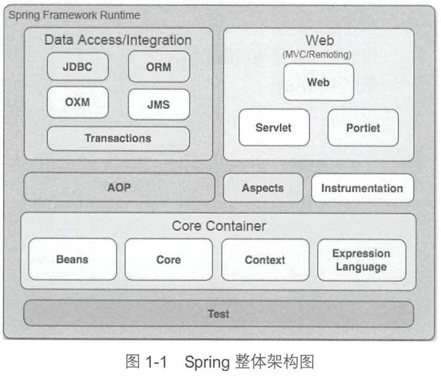
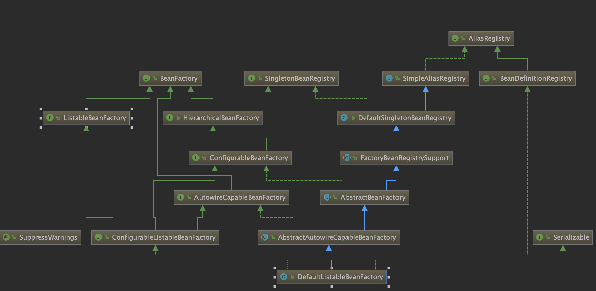
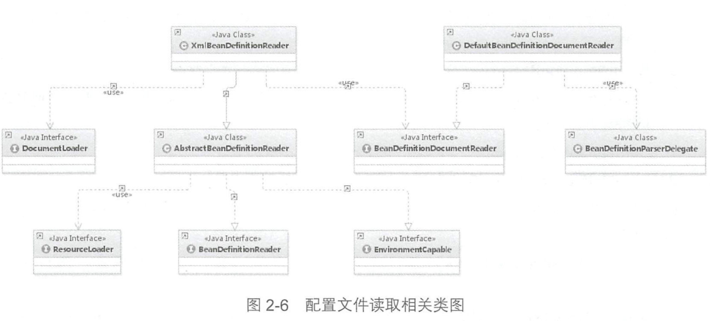

## spring源码读书笔记

### 容器

#### 核心类

##### `DefaultListableBeanFactory`

`AliasRegistry` 增加对alias的支持  `SimpleAliasRegistry`是他的map缓存实现

`SingletonBeanRegistry` 定义对单例的注册和获取，`DefaultSingletonBeanRegistry`是其简单实现。

`BeanDefinitionRegistry` bean定义的各种操作

`BeanFactory`获取bean和bean的各种属性

`FactoryBeanRegistrySupport`增加对FactoryBean的处理

`ConfigurableBeanFactory `提供配置各种factory的方法

`ListableBeanFactory`定义根据各种条件获取bean的配置清单

`AbstractBeanFactory`综合`ConfigurableBeanFactory `和`FactoryBeanRegistrySupport`

`AutowireCapableBeanFactory`提供定义自动创建bean和自动注入、初始化

`ConfigurableListableBeanFactory` 是`BeanFactory`的配置清单，指定忽略类型和接口

##### XmlBeanDefinitionReader

通过reader加载bean信息

###### 获取xml验证模式

1. 是否手动设定了验证模式
2. 根据resource获取验证模式，如果检查到有`DOCTYPE`则是**DTD**检测，否则使用**xsd**
3. 默认使用XSD验证

replace-method和lookup-method记录在`Beandefine`的`methodOverride`中

### 加载bean

存储bean的不同map：

- **singletonObjects** 用于保存beanName和创建bean实例之间的关系
- **singletonFactories** 保存beanName和创建工厂之间的关系，存储的BeanFactory
- **earlySingletonObjects** 保存beanName和创建bean实例之间的关系，当一个单例bean呗放到这里，如果这个bean还在创建中，就可以通过getBean方法获取到
- **registerSingletons** 保存当前所有已注册的bean

`getObjectForBeanInstance` 在获取bean之后，一般会调用这个方法，检测bean是否是`BeanFactory`类型的，如果是则获取对应的bean

#### 循环依赖解决

**构造器循环依赖会抛出异常，单例模式下的setter循环依赖解决，主要是通过spring容器提前暴露刚完成构造器注入但未完成其他步骤的bean来完成**，在A->B->C->A依赖的情况下解决步骤:

1. 容器创建单例A，首先，创建bean，暴露一个ObjectFactory,用于返回一个提前暴露一个创建中的bean 并将A标识符放到**当前创建bean池**，然后进行setter注入B
2. 容器创建单例B，首先，创建bean，暴露一个ObjectFactory,用于返回一个提前暴露一个创建中的bean 并将B标识符放到**当前创建bean池**，然后进行setter注入C
3. 容器创建单例B，首先，创建bean，暴露一个ObjectFactory,用于返回一个提前暴露一个创建中的bean 并将B标识符放到**当前创建bean池**，然后进行setter注入A，注入A时，由于提前暴露了ObjectFactory工厂，使他能返回创建中的bean A

### ApplicationContext

applicationContext作为BeanFactory的扩展,

#### beanFactory的后处理

spring通过`BeanFactoryPostProcessor`和`BeanPostProcessor`实现在bean初始化的时候，读取bean原本的元数据对bean进行修改

> 该功能的典型应用就是**PropertyPlaceholderConfigurer**,当spring加载了任何实现`BeanFactoryPostProcessor`的接口的bean时，都会在bean工厂载入所有的bean配置后执行postProcessBeanFactory方法，进行处理

### skill

- doXXXX 方法名  做某事
- 使用模板方法进行解析前和解析后的处理
- lookup-method可以指定某个bean方法的调用实现
- replace-method 替换某个bean的方法
- 真正干活的函数都是以**do**开头的
- 处理类 重写InstantiationAwareBeanPostProcessor的postProcessBeforeInstantiation方法可以在spring创建bean的时候改变bean
- `AbstractRefreshableApplicationContext`中设置是否允许**循环依赖**，allowCircularReferences
- 激活aware是放在bean初始化中

### TODO

- [ ] mergeBeanDefinePostProcesser
- [ ] DisposableBean