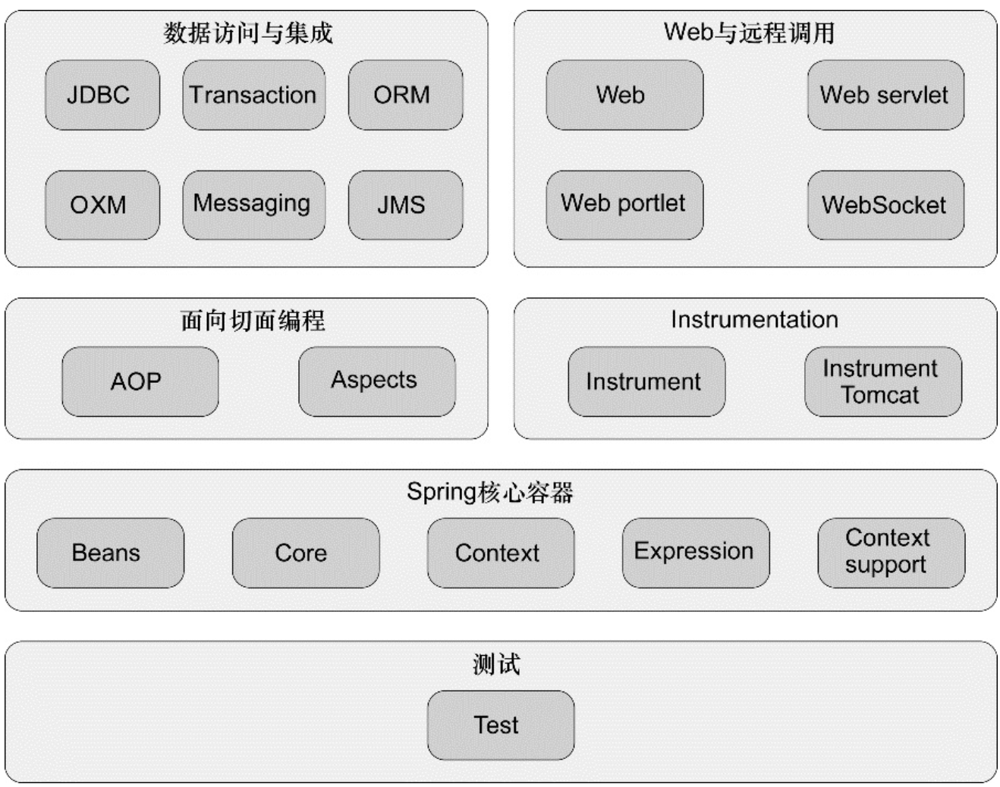

# spring概览



## spring核心

容器主要基于`BeanFactory`进行，ApplicationContext是他的主要子类

ApplicationContext.getBeanFactory() 获得的beanFactory可以进行bean相关注册处理等

可以实现自己的BeanPostProcessor来处理一些spring容器不支持的生命周期方法

#### 生命周期

- 实现`InitializingBean`和`DisposableBean接口`，调用afterPropertiesSet和destroy方法

- The JSR-250 `@PostConstruct` and `@PreDestroy`注解

- ```xml
  <beans default-init-method="init">
  ```

- **拦截器不能用于init方法**

- 实现Lifecycle接口 SmartLifecycle

#### 依赖注入

可以自定义限定词`qualifier`，通过自定义的限定词进行注入

```java
@MovieQualifier(format=Format.VHS, genre="Action")
```

自定义依赖注入配置:`CustomAutowireConfigurer`

`Resource`注解会先按照**名字**注入，找不到时按照类型注入 

当使用`component-scan`元素时，将隐式包括`AutowiredAnnotationBeanPostProcessor`和`CommonAnnotationBeanPostProcessor`

[主要的Aware](https://docs.spring.io/spring/docs/5.1.13.BUILD-SNAPSHOT/spring-framework-reference/core.html#aware-list)

```properties
-Dspring.profiles.active="profile1,profile2"
```

`Environment`主要包括`profile`和`properties`

#### 自定义bean

`BeanPostProcessor`可以定义spring容器bean的自定义实例化逻辑`BeanPostProcessor`的回调在bean的实例化完成后**初始化**之前和初始化之后执行，部分aop的实现就是基于`BeanPostProcessor`完成的,并且该接口的实现类不能进行自动代理

PropertyPlaceholderConfigurer和`PropertyOverrideConfigurer`是BeanFactoryPostProcessor的实现，使用CustomAutowireConfigurer可以定义自动注入的实现

#### java配置spring

**component-scan**主要提供`AutowiredAnnotationBeanPostProcessor`和`CommonAnnotationBeanPostProcessor`，可以通过自定义 [`BeanNameGenerator`](https://docs.spring.io/spring-framework/docs/5.1.13.RELEASE/javadoc-api/org/springframework/beans/factory/support/BeanNameGenerator.html)来修改bean名称的自动生成，修改scopeResolver来处理scope

`AnnotationConfigApplicationContext`是注解驱动的context

**Lookup Method**和**replace-method**是重要的更改类的方式

prifole实际上是通过**@Conditional**实现的。

#### Environment

Environment是容器的一个主要抽象，主要包括两部分:**profiles**和**properties**

默认启用的profile是**default**激活profile的两种方式:

1.ctx.getEnvironment().setActiveProfiles("development");

2.spring.profiles.active属性激活，该属性可以配置在系统环境变量，JVM系统属性，web.xml中的servlet上下文参数中

默认的Env是**StandardEnvironment**，它主要包含了两块属性配置:JVM属性配置(System.getProperties())和环境变量(System.getenv()),**StandardServletEnvironment**填充了servlet配置和servlet上下文参数

`@PropertySource`会添加一组PropertySource到Env中

applicationContext主要还包括以下功能:

- 通过MessageSource界面访问i18n样式的消息

- 通过ResourceLoader界面访问资源，例如URL和文件。

- 通过使用ApplicationEventPublisher接口，将事件发布到实现ApplicationListener接口的bean。

- 加载多个（分层）上下文，使每个上下文通过

  ##### 国际化

  主要通过ResourceBundleMessageSource类实现

  ##### 事件驱动

可以使用ContextLoaderListener来创建`ApplicationContext`

```xml
<context-param>
    <param-name>contextConfigLocation</param-name>
    <param-value>/WEB-INF/daoContext.xml /WEB-INF/applicationContext.xml</param-value>
</context-param>
<listener>
    <listener-class>org.springframework.web.context.ContextLoaderListener</listener-class>
</listener>
```

| Feature                                                 | `BeanFactory` | `ApplicationContext` |
| :------------------------------------------------------ | :------------ | :------------------- |
| Bean instantiation/wiring                               | Yes           | Yes                  |
| Integrated lifecycle management                         | No            | Yes                  |
| Automatic `BeanPostProcessor` registration              | No            | Yes                  |
| Automatic `BeanFactoryPostProcessor` registration       | No            | Yes                  |
| Convenient `MessageSource` access (for internalization) | No            | Yes                  |
| Built-in `ApplicationEvent` publication mechanism       | No            | Yes                  |

### Resources

内置resources:`UrlResource`、`ClassPathResource`、`FileSystemResource`、`ServletContextResource`、`InputStreamResource`、`ByteArrayResource`

### Databind/Validator/

ValidationUtils、BeanWrapper，spring通过PropertyEditor来显示http请求的解析、*PropertyEditorSupport、CustomEditorConfigurer、PropertyEditorRegistrar*组合使用解析属性

所有的beanfactory和applicationContext都是用**BeanWrapper**进行处理属性转换

##### 属性转换

使用`Converter`进行类型转换，`ConverterFactory`、GenericConverter、`ConversionService`

```xml
<bean id="conversionService"
    class="org.springframework.context.support.ConversionServiceFactoryBean"/>
```

##### formatter

主要包括NumberStyleFormatter、CurrencyStyleFormatter、PercentStyleFormatter、DateFormatter、@NumberFormat、@DateTimeFormat

[配置一个全局的时间转换器](https://docs.spring.io/spring/docs/5.1.13.RELEASE/spring-framework-reference/core.html#format-configuring-formatting-globaldatetimeformat)

### SPEL

主要可以用于:文字、布尔和关系运算、表达式、访问属性或数组、方法调用、关系运算符、分配、调用构造函数、bean参考、内联列表、三元运算符、变数、用户定义的功能

### spring AOP编程

#### AOP核心概念

**方面** 涉及多个类别关注点的模块化

**连接点** 程序执行过程中的一个点 例如:方法执行或者异常处理

**通知** 方面在连接点处采取的操作 包括了:BEFORE、After return、after throw、after、around

**切入点** 与连接点匹配的谓词，通知与切入点表达式相关联，并在与改切入点匹配的连接点运行，切入点表达式匹配作为连接点的概念是AOP的核心，spring摩恩使用AspectJ的表达式

**引入** 类型声明的其他方法或者字段，可以向任何**通知**对象引入新的接口或者实现(给通知对象添加额外定义)

**目标对象** 方面需要通知的对象，也称为**通知对象**，在spring中都是spring动态代理的对象

**AOP代理** AOP框架创建的代理对象，用于实施**方面**的约定(*通知*方法的执行)，一般是通过CGLIB代理的

**编织** 将应用对象和方面链接起来创建通知对象，可以在编译时、运行时、类加载时完成

AOP默认使用JDK标准的动态代理,使用<aop:aspectj-autoproxy/>或者@EnableAspectJAutoProxy开启@AspectJ模式的AOP

切入点的符号：

- **execution** 方法执行
- **within** 限制匹配某些特殊类型
- `this` 限制匹配某些类型的bean实例
- `target` 限制匹配给定类型的实例
- `args` 限制匹配给定的参数范围
- `@target` 限制匹配给定类型的注释
- `@args` 限制匹配参数具有给定类型的注解
- `@within` 
- `@annotation`

表达式声明 

```java
execution(modifiers-pattern? ret-type-pattern declaring-type-pattern?name-pattern(param-pattern)
            throws-pattern?)
例子:execution(public * *(..))
execution(* com.xyz.service.AccountService.*(..))
args(java.io.Serializable)
```

好的切入点应该至少包含种类和作用域

#### 代理机制

**ProxyFactory**

编程方式创建AOP代理

```java
AspectJProxyFactory factory = new AspectJProxyFactory(targetObject);
// add an aspect, the class must be an @AspectJ aspect
// you can call this as many times as you need with different aspects
factory.addAspect(SecurityManager.class);
// you can also add existing aspect instances, the type of the object supplied must be an @AspectJ aspect
factory.addAspect(usageTracker);
// now get the proxy object...
MyInterfaceType proxy = factory.getProxy();
```

**`DataBufferUtils`**

## spring web

servlet3.0+可以使用WebApplicationInitializer纯代码的方式初始化servlet容器

`DispatcherServlet` 需要一个`WebApplicationContext`作为其配置，WebApplicationContext与`ServletContext`相关联，`RequestContextUtils可以来查找WebApplicationContext`

> `WebApplicationContext`的主要实现是`XmlWebApplicationContext`(采用web.xml格式时，默认就是该配置，可以通过**contextClass**进行覆盖)和`AnnotationConfigWebApplicationContext`

`DispatcherServlet`将请求委托给一些特殊的内置bean，应用程序可以声明自己的bean实现，默认的bean实现在[`DispatcherServlet.properties`](https://github.com/spring-projects/spring-framework/blob/master/spring-webmvc/src/main/resources/org/springframework/web/servlet/DispatcherServlet.properties)中声明

**HandlerMapping** 将请求映射到拦截器和处理程序 两个主要的实现类`RequestMappingHandlerMapping`和`SimpleUrlHandlerMapping`

**HandlerAdapter** 帮助DispatcherServlet调用请求映射的处理程序，免受调用细节的侵扰

[`HandlerExceptionResolver`](https://docs.spring.io/spring/docs/5.1.13.RELEASE/spring-framework-reference/web.html#mvc-exceptionhandlers) 异常的处理策略

[`ViewResolver`](https://docs.spring.io/spring/docs/5.1.13.RELEASE/spring-framework-reference/web.html#mvc-viewresolver) 解析处理程序返回的字符串对应的实际视图

[`LocaleResolver`](https://docs.spring.io/spring/docs/5.1.13.RELEASE/spring-framework-reference/web.html#mvc-localeresolver), [LocaleContextResolver](https://docs.spring.io/spring/docs/5.1.13.RELEASE/spring-framework-reference/web.html#mvc-timezone)  解决客户的语言环境和地区问题

[`ThemeResolver`](https://docs.spring.io/spring/docs/5.1.13.RELEASE/spring-framework-reference/web.html#mvc-themeresolver) 主题处理器

[`MultipartResolver`](https://docs.spring.io/spring/docs/5.1.13.RELEASE/spring-framework-reference/web.html#mvc-multipart) 借助一些二进制库来处理二进制请求的抽象

DispatcherServlet处理请求的流程:

1. 搜索WebApplicationContext并将球绑定为请求的属性
2. 将语言环境解析器绑定到请求
3. 将主题解析求绑定到请求
4. 如果指定了文件解析器，则查看请求中是否有二进制文件部分，如果有则将请求包装到MultipartHttpServletRequest中
5. 搜索匹配的handler，如果找到则执行关联的执行链
6. 如果返回model 则呈现对应视图
7. 如果过程中发生异常则调用HandlerExceptionResolver处理

DispatcherServlet支持的配置contextClass、contextConfigLocation、namespace、throwExceptionIfNoHandlerFound

HandlerExceptionResolver的内置实现:**SimpleMappingExceptionResolver、DefaultHandlerExceptionResolver、ResponseStatusExceptionResolver、ExceptionHandlerExceptionResolver**

##### **ViewResolver**

提供了视图名称和实际视图之间的映射，常用内置实现:AbstractCachingViewResolver、XmlViewResolver、ResourceBundleViewResolver、UrlBasedViewResolver、InternalResourceViewResolver、FreeMarkerViewResolver、ContentNegotiatingViewResolver

redirect: 之情重定向

forward:执行跳转

### filter

springmvc 提供的内置filer:[Form Data](https://docs.spring.io/spring/docs/5.1.13.RELEASE/spring-framework-reference/web.html#filters-http-put)、[Forwarded Headers](https://docs.spring.io/spring/docs/5.1.13.RELEASE/spring-framework-reference/web.html#filters-forwarded-headers)、[Shallow ETag](https://docs.spring.io/spring/docs/5.1.13.RELEASE/spring-framework-reference/web.html#filters-shallow-etag)、[CORS](https://docs.spring.io/spring/docs/5.1.13.RELEASE/spring-framework-reference/web.html#filters-cors)

在`org.springframework.web.filter`包下还有:CharacterEncodingFilter、

### controller

可以手动注册一个映射:

```java
@Autowired
    public void setHandlerMapping(RequestMappingHandlerMapping mapping, UserHandler handler) 
            throws NoSuchMethodException {
        RequestMappingInfo info = RequestMappingInfo
                .paths("/user/{id}").methods(RequestMethod.GET).build(); 
        Method method = UserHandler.class.getMethod("getUser", Long.class); 
        mapping.registerMapping(info, handler, method); 
    }
```

方法的参数是根绝配置的**converters**转换，可以通过实现一个`WebDataBinder`自定义部分转换，参数中支持的注解:

`@CookieValue`、@RequestParam、`@RequestHeader`、`@ModelAttribute``@SessionAttributes`、`@SessionAttribute`、`@RequestAttribute`、`@RequestBody`、`MultipartFile`、HttpEntity、ResponseEntity

controller可以有一个@`InitBinder`注释的放，来初始化一个WebDataBinder，可以基于`FormattingConversionService`的实现进行重用

#### exception

通过@ExceptionHandler进行处理。注解方法支持的参数:[参数](https://docs.spring.io/spring/docs/5.1.13.RELEASE/spring-framework-reference/web.html#mvc-ann-exceptionhandler-args)

通过定义`@ControllerAdvice` or `@RestControllerAdvice`来定义全局的controller配置

#### URI链接

UriComponents固件URI、ServletUriComponentsBuilder、MvcUriComponentsBuilder

通过返回[`DeferredResult`](https://docs.spring.io/spring/docs/5.1.13.RELEASE/spring-framework-reference/web.html#mvc-ann-async-deferredresult) and [`Callable`](https://docs.spring.io/spring/docs/5.1.13.RELEASE/spring-framework-reference/web.html#mvc-ann-async-callable) 实现请求的异步处理

#### MVC CONFIG

默认支持 `@NumberFormat` and `@DateTimeFormat`两种注解 进行数据类型转换

mvc:view-controller 如果请求不想通过controller直接跳转可以配置这个

**高级模式**可以直接扩展类**DelegatingWebMvcConfiguration**不用EnableWebMvc注解

#### Restclient

RestTemplate和WebClient

## 其他集成

spring支持的其他主要集成包括:

**RMI服务**

**Hessian** http调用

**Spring HTTP Invoker** 轻量级htto调用

**JAX-WS** Java API for XML Web Services

**JMS**

**AMQP**

**`RestTemplate`**

**EMAL**

**TaskExecutor**


