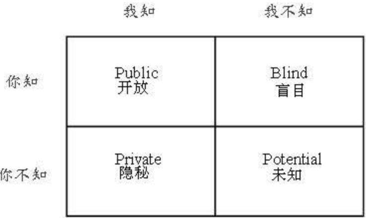
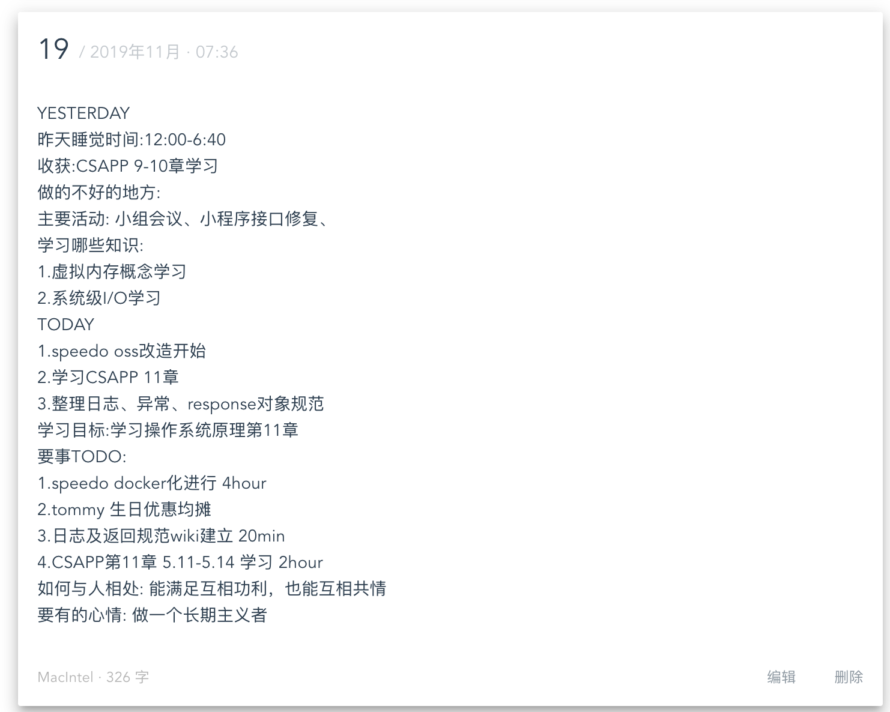
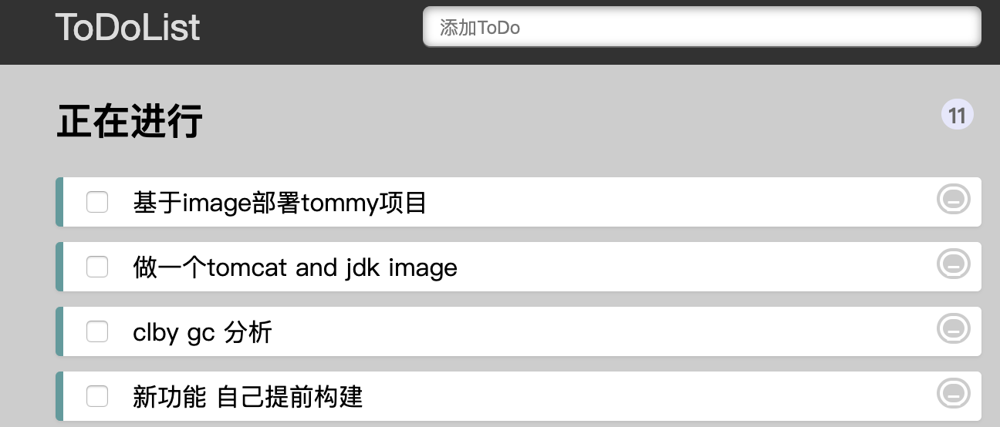
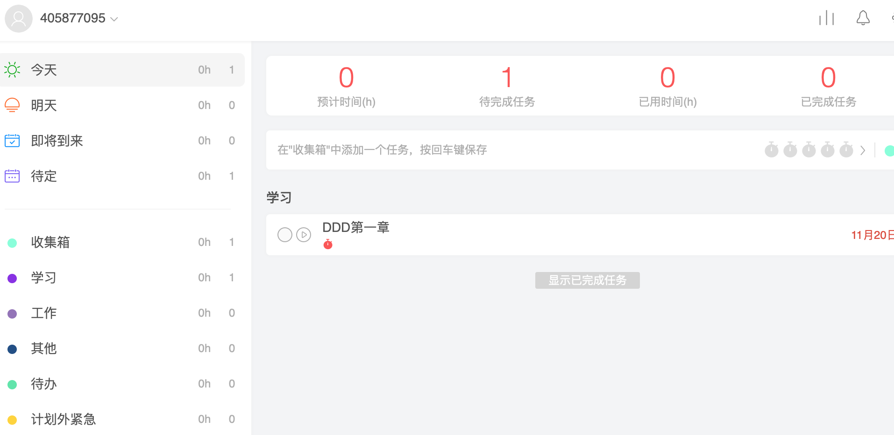

<!-- .slide: data-background="./timg2.jpeg" -->

# 可复制的领导力

阅读笔记

​			--谢远航

---


<!-- .slide: data-background="./tree.jpg" -->

## 关键词

**标准化、一致性**<!-- .element: class="fragment" data-fragment-index="0" -->

**授权、尊重与信任、成长** <!-- .element: class="fragment" data-fragment-index="1" -->

**情感账户、沟通、倾听、反馈** <!-- .element: class="fragment" data-fragment-index="2" -->

**效率** <!-- .element: class="fragment" data-fragment-index="3" -->

---

<!-- .slide: data-background="./tree.jpg" -->

### 标准化

领导力是可复制的，可复制的前提是对于领导力的标准化,标注化是核心竞争力

提升领导力的四重修炼: 做好本职工作(别人信任你)、授权(信任别人)、标准化(制定标准,多用工具和自动化)、一致的价值观和文化

部署任务标准化步骤:

1. 分配任务
2. 确认任务
3. 确认任务目的
4. 确认任务的异常情况
5. 询问是否有好的想法和建议

---

<!-- .slide: data-background="./tree.jpg" -->

### 管理与授权

管理者的使命是培养员工,打造有战斗力的团队,而不是将工作都加在自己身上,成为优秀管理者的首要条件就是重视人、培养人。管理就是通过别人完成任务? 

```
协调团队"一致的"完成任务
```

<!-- .element: class="fragment" data-fragment-index="0" -->

管理的要点:

- 授权信任员工（应该是责任型授权）

  ```
  授权应该是责任型授权,责任型授权:预期成果、指导方针、可用资源、
  责任归属、明确奖惩
  ```

  <!-- .element: class="fragment" data-fragment-index="1" -->

- 授权前期,别怕犯错 (犯错的阶段和处理方式、**反馈**的形式)

- **调动员工工作意愿 激发工作热情**

- 管理者和被管理者 应该互相帮助，共同进步


----

<!-- .slide: data-background="./tree.jpg" -->

管理者的三大角色

下层执行(使命必达)、中层管理(面面俱到的管理才能)、 上层领导(团队情绪、高瞻远瞩(方向))

TL的三重人格<!-- .element: class="fragment" data-fragment-index="1" -->

技术决策者、流程监督人、干扰过滤器<!-- .element: class="fragment" data-fragment-index="1" -->

**提升管理能力:刻意练习** <!-- .element: class="fragment" data-fragment-index="1" -->

[Tech Lead的三重人格](https://insights.thoughtworks.cn/thoughtworks-practice-part8/)<!-- .element: class="fragment" data-fragment-index="1" -->


----

<!-- .slide: data-background="./tree.jpg" -->

管理能力表现在营造氛围，让工作变得有趣,游戏化是一种方式

清晰的游戏规则

及时的反馈系统,这里的反馈基本都是正面反馈

自愿参与的游戏机制

* 找到自愿参与的人 工作不掺杂个人情绪
* 为员工设置期望值 通过设置期望值，尽可能点燃员工工作热情
* 不能过于提高员工对企业的期望值
* 用协议时刻提醒员工 协议不应该是胁迫鼓励为主


---

<!-- .slide: data-background="./tree.jpg" -->

### 一致性

**一致性**在团队内部是非常重要的话题，努力方向不一致就会增加内耗,大家聚在一起是为了赢得胜利，为了进步，为了团队变得更优秀，确定团队和员工的目标一致为最高原则。

强调团队一致性的好时机:
员工离职时、发奖金时(发奖金不应该神秘、低调).

> 善待前员工，为他们提供便利(要有双赢的思维)


---

<!-- .slide: data-background="./tree.jpg" -->

### 目标

目标是一切管理的基础和开始，是个人的精神支柱是	企业发展的最大驱动力。目标管理就是要从目标层面调动团队各成员的工作积极性，完成共同的使命(一致性)

目标的特征:目标因人而异,反应每个人独特的技术和能力、成员全程参与、可测量、及时反馈和沟通、目标灵活可变

根据人员层级划分为3类:

* 方向型目标 团队奋斗的大方向，指引团队各成员奋斗的最终方向,团队比的是方向和规划(公司级战略)
* 过程型目标 近期可以达到的效果，具有一定的的结构性和逻辑性,是基于战略目标的拆分(OKR)
* 理性清晰的具体目标 (个人绩效目标?个人OKR)，要根据员工的实际能力而定(绩效目标)
团队管理者是目标的践行者和推动者也是制定者和维护者(流程监督人)

----

<!-- .slide: data-background="./tree.jpg" -->

#### 目标的标准化

成功的目标管理的共性：标准化的流程

法则:SMART
* SPECIFIC 明确具体 目标必须是明确具体的，只有这样团队成员才能正确理解
* Measurable 可量化 
* Attainable 可接受、可实现 目标必须是可接受实现的，传达过程中也必须组好沟通工作(敏捷的迭代目标，不要每次都没有完成迭代目标)
* Realistic 符合实际 全面客观的看待问题
* Time limited 有时间限制 有检查点(deadline)

书写标准:标准制定书写:目标书写=动词+任务+指标+目标

制定流程:书写目标->列出阻碍因素->列出可帮助条件->写下个人特征->列出要做的事情(action,按照执行、管理、领导角色)

---

<!-- .slide: data-background="./tree.jpg" -->

### 沟通+倾听

沟通和倾听是和别人建立情感账户，加深尊重和信任的最好时机

乔哈里视窗



个人工作的进程就是公开象限不对放大的过程，就是一个人不断成长的过程，靠成员尊重和信任来约束的行为才叫领导
* 将隐私象限转换为公开象限 就是团队内部的深刻沟通
* 将盲点象限转换为公开象限 恳请反馈


----

<!-- .slide: data-background="./tree.jpg" -->

### 倾听

要想让别人了解你，你需要先了解别人(知彼解己) 倾听别人,才能更好的沟通

倾听的标准化步骤:
深呼吸:平复情绪，集中注意力 认证倾听
提问 传递信任和尊重 封闭性提问和开放性提问
复述:信息确认 布置任务时 需要确认 即确保一致性

注意点:

- 用认同化解对方的情绪失控
- 注意沟通时的肢体语言(目光、手势、推、距离)

- 看似无关紧要的细节，会消耗**情感账户**，如：忽视礼貌、不经意的失言 倾听时尤为重要

---

<!-- .slide: data-background="./tree.jpg" -->

### 反馈


管理者和员工要建立足够的尊重和信任，管理成本就会降低，通过正面的反馈，培养员工自尊心，达到自律。来建立尊重和信任

- 反馈需要及时
- 认识到每个人看待事情的角度不一样，所处的情境和情绪不同，容易出现偏差，反馈只是陈述看到的，而不带情绪
- 不要轻易的对员工做推理
- 反馈要赋予情感和激情正面反馈要远多于负面反馈，过多的负面反馈会让员工没有自信心，不敢做事


----

<!-- .slide: data-background="./tree.jpg" -->

- 正面反馈:表扬并告诉他原因
- 负面反馈时不能带有个人情绪个主管色彩

正面反馈是往情感账户存入存款的好时机<!-- .element: class="fragment" data-fragment-index="0" -->

反馈是相互的<!-- .element: class="fragment" data-fragment-index="1" -->


---

<!-- .slide: data-background="./tree.jpg" -->

### 效率

要事第一:有效利用时间 

 对于管理者什么是要事?  

全局规划,解决根本问题 ，管理者最重要的任务是培养、带领员工成长 <!-- .element: class="fragment" data-fragment-index="0" -->

对于团队什么是要事?

阶段性目标 (根据反馈不断调整)<!-- .element: class="fragment" data-fragment-index="1" -->

团队高效会议的标注化:六项思考帽和brain storm

对于个人什么是要事?

可以参考高效能人士7个习惯时间的时间管理矩阵<!-- .element: class="fragment" data-fragment-index="2" -->

管人而不是管事:责任型授权(信任)、命令型授权 <!-- .element: class="fragment" data-fragment-index="3" -->

----

<!-- .slide: data-background="./tree.jpg" -->

### 标准化：GTD (也是个人推荐的方式）

1. 收集 卡片  最好是电子格式工具 必须要有记录

2. 整理 区分可以立即完成和不可立即完成

3. 组织 行动清单 等待清单(委派) 未来清单 

4. 回顾 每周进行清单回顾 检查 更新

5. 执行 专注于眼前事务(节奏)

   有追踪,有记录。一定要形成**闭环**

   

----

<!-- .slide: data-background="./tree.jpg" -->

## 晨间笔记

把最重要的目标安排在精力充沛的时间，意味着在判断力最佳的状态下做出突



[这样写「待办事项」，能极大地提升你的效率](http://dy.163.com/v2/article/detail/E3KOCNUG05119NPR.html)


----


<!-- .slide: data-background="./tree.jpg" -->

### 善于利用工具






**适合自己的才是最好的,最终是要达成目标**<!-- .element: class="fragment" data-fragment-index="0" -->


