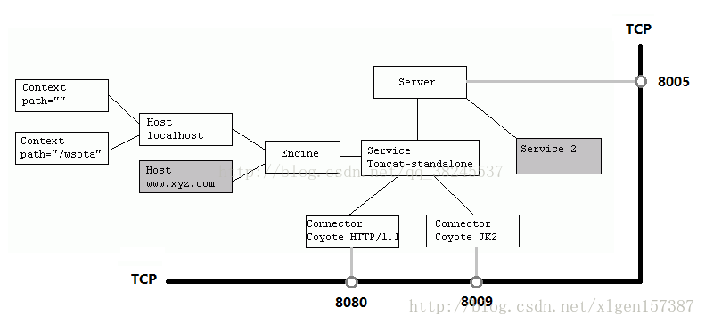
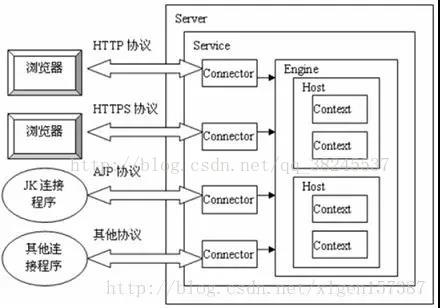

# tomcat剖析

Tomcat 就是一个 Servlet 容器, 能接收用户从浏览器发来的请求, 然后转发给 Servlet 处理, 把处理完的响应数据发回浏览器

总体架构:

- 面向组件架构
- 基于JMX
- 事件侦听

 [java参数文档.md](../../java/java参数文档.md) 

## 结构剖析

### 整体剖析

[tomcat剖析参考文章](https://www.jianshu.com/nb/18936835)

 https://www.jianshu.com/nb/30714822 

#### 目录

- tomcat 组件及架构设计
- tomcat简单实现示例
- 理解tomcat每个组件的设计
- 从2个链路tomcat启动和处理http请求理解tomcat

> servlet的三个基本任务
>
> 1.创建一个 Request 对象, 用可能会在调用的 Servlet 中使用到的信息填充该 Request 对象, 如参数, 头, cookie, 查询字符串, URI 等, Request 对象是 javax.servlet.ServletRequest 接口或 javax.servlet.ServletRequest 接口的一个实例.
>
> 2.创建一个调用 Servlet 的 Response 对象, 用来向 Web 客户端发送响应. response 对象是 javax.servlet.http.ServletResponse 接口或 javax.servlet.ServletResponse 接口的一个实例;
>
> 3.调用 Servlet 的 service 方法, 将 request 对象和 response 对象作为参数传入, Servlet 从 request 对象中读取信息, 并通过 response 对象发送响应信息.

tomcat 的主体是 Catalina,主要划分为两个模块: **连接器(connector)和容器(container)**.*连接器和 Servlet 容器是一对多的关系*.

#### Tomcat 整体的框架层次：4个层次, 其中 Connector 和 Container 是最重要的.


1. Server 和 Service
2. Connector
   - HTTP
   - AJP (apache 私有协议，用于tomcat和apache静态服务器通信)
3. Container
   - Engine
   - Host
   - Context
   - Wrapper
4. Component
   - Manager （管理器）
   - logger （日志管理）
   - loader （载入器）
   - pipeline (管道)
   - valve （管道中的阀）

*Server*是整个Tomcat组件的容器，包含一个或多个Service。 *Service*：Service是包含Connector和Container的集合，Service用适当的Connector接收用户的请求，再发给相应的Container来处理。

基于JMX Tomcat会为每个组件进行注册过程，通过Registry管理起来，而Registry是基于JMX来实现的，因此在看组件的init和start过程实际上就是初始化MBean和触发MBean的start方法

### 类图


### 构件图

#### 整体架构图


#### Container架构


#### server.xml表示图



### 时序图


请求图:



## 类加载


每一个应用程序对应一个WebApp类加载器，每个jsp文件对应一个jsp类加载器

- commonLoader：Tomcat最基本的类加载器，加载路径中的class可以被Tomcat容器本身以及各个Webapp访问；

- catalinaLoader：Tomcat容器私有的类加载器，加载路径中的class对于Webapp不可见；

- sharedLoader：各个Webapp共享的类加载器，加载路径中的class对于所有Webapp可见，但是对于Tomcat容器不可见；

- WebappClassLoader：各个Webapp私有的类加载器，加载路径中的class只对当前Webapp可见；

securityClassLoad方法主要加载Tomcat容器所需的class，使用的是catalinaClassLoader，对webapp不可见.包括：

- Tomcat核心class，即org.apache.catalina.core路径下的class；
- org.apache.catalina.loader.WebappClassLoader$PrivilegedFindResourceByName；
- Tomcat有关session的class，即org.apache.catalina.session路径下的class；
- Tomcat工具类的class，即org.apache.catalina.util路径下的class；
- javax.servlet.http.Cookie；
- Tomcat处理请求的class，即org.apache.catalina.connector路径下的class；
- Tomcat其它工具类的class，也是org.apache.catalina.util路径下的class

> WebAppClassLoaser在StandardContext初始化的时候一起初始化

## 生命周期

基于JMX进行生命周期管理

> JMX 即 Java Management Extensions(JMX 规范), 是用来对 tomcat 进行管理的. tomcat 中的实现是 commons modeler 库, Catalina 使用这个库来编写托管 Bean 的工作. 托管 Bean 就是用来管理 Catalina 中其他对象的 Bean.

jmx架构图


生命周期类图:


tomcat类图:


### 请求剖析

过程见时序图

## 组件

Tomcat 是由容器组成的，容器从大到小的排列依次是：Server-->Service---->Engine--->Host--->Context--->Wrapper,那么当一个请求过来，从大容器到小容器，他们一个一个的传递，像接力比赛.

> *Tomcat*中有四大容器类*StandardEngine*，*StandardHost*，*StandardContext*及*StandardWrapper*。在每个容器对象里面都有一个*pipeline*及*valve*模块.

StandardWeapperValve中会获取ApplicationFilterFactory 单例，调用该单例的 createFilterChain 方法获取 ApplicationFilterChain 过滤器链实例，执行过滤器链 filterChain 的 doFilter 方法。该方法会循环执行所有的过滤器，最终执行 servlet 的 servie 方法

### Server

Server元素代表整个Catalina Servlet容器

内嵌的元素主要是:**service**、**GlobalNamingResources**

主要实现`org.apache.catalina.core.StandardServer`

### service

service元素表示一个或多个连接器组件的组合，它们共享一个引擎组件来处理传入的请求。一个或多个Service元素可以嵌套在Server元素内

内嵌的元素是**Connector**、**executor**

标准实现:`org.apache.catalina.core.StandardService`

### Connectors

主要分为**Http**connector和**Ajp**connector，Connector把从socket传递过来的数据， 封装成Request, 传递给容器来处理。 通常我们会用到两种Connector,一种叫http connectoer， 用来传递http需求的.StandardService 聚合了 Connector 数组和一个Container 容器.

Connector的创建主要是创建**ProtocolHandler**对象,而ProtocolHandler主要是构造**JIoEndpoint对象**

各链接器比较

```
                       Java Blocking Connector   Java Non Blocking Connector   APR/native Connector
                                 BIO                         NIO                       APR
    Classname              Http11Protocol             Http11NioProtocol         Http11AprProtocol
    Tomcat Version           3.x onwards                 6.x onwards              5.5.x onwards
    Support Polling              NO                          YES                       YES
    Polling Size                 N/A                   maxConnections             maxConnections
    Read Request Headers      Blocking                  Non Blocking                 Blocking
    Read Request Body         Blocking                    Blocking                   Blocking
    Write Response            Blocking                    Blocking                   Blocking
    Wait for next Request     Blocking                  Non Blocking               Non Blocking
    SSL Support               Java SSL                    Java SSL                   OpenSSL
    SSL Handshake             Blocking                  Non blocking                 Blocking
    Max Connections        maxConnections              maxConnections             maxConnections
```

#### HTTP

HTTP Connector元素代表支持HTTP / 1.1协议的Connector组件。 除了执行servlet和JSP页面的功能外，它还使Catalina能够充当独立的Web服务器。 该组件的特定实例侦听服务器上特定TCP端口号上的连接。 可以将一个或多个此类连接器配置为单个服务的一部分，每个连接器都转发到关联的引擎以执行请求处理并创建响应。

> 每个传入请求在该请求期间需要一个线程。 如果接收到的并发请求多于当前可用请求处理线程可以处理的数量，则将创建其他线程，直到配置的最大值（maxThreads属性的值）为止。 如果接收到更多并发请求，它们将堆积在连接器创建的服务器套接字内，直到配置的最大值（acceptCount属性的值）为止。 任何进一步的同时请求都将收到“连接被拒绝”错误，直到有足够的资源来处理它们为止

##### HTTP/1.1 and HTTP/1.0 Support

包括持久连接，流水线，期望和分块编码

##### Proxy Support

##### SSL Support

通过将SSLEnabled属性设置为true，可以对此连接器的特定实例启用SSL支持。

您还需要将方案和安全属性分别设置为值https和true，以将正确的信息传递给servlet

#### Ajp

AJP连接器元素表示一个通过AJP协议与Web连接器通信的连接器组件。 这用于以下情况：希望将Tomcat无形地集成到现有（或新的）Apache安装中，并且希望Apache处理Web应用程序中包含的静态内容，和/或利用Apache的SSL处理。

### Executor

executor表示可以在Tomcat中的组件之间共享的线程池。 从历史上看，每个连接器都会创建一个线程池，但是当配置为支持执行器时，您可以在（主要）连接器之间以及其他组件之间共享线程池

唯一实现类:`org.apache.catalina.Executor`

### container

#### context

Context元素表示一个Web应用程序，它在特定的虚拟主机中运行。 每个Web应用程序都基于Web应用程序存档（WAR）文件或包含相应解压缩内容的相应目录

> Catalina通过将Request URI的最长可能前缀与每个定义的Context的上下文路径进行匹配，来选择用于处理每个HTTP请求的Web应用程序。 选择之后，该上下文将根据Web应用程序部署定义的servlet映射，选择适当的servlet来处理传入的请求。

应该将server.xml中定义的<Context>元素的override属性设置为true

标准实现类:`org.apache.catalina.core.StandardContext`

内嵌组件:**loader**、**manager**、**realm**、**resources**、**watcherResource**

#### host

Host元素代表虚拟主机，它是服务器（例如“ www.mycompany.com”）的网络名称与运行Tomcat的特定服务器的关联。

一个或多个Host元素嵌套在Engine元素内,在Host元素内，您可以为与此虚拟主机关联的Web应用程序嵌套Context元素。 与每个引擎关联的主机中

标准实现类:`org.apache.catalina.core.StandardHost`

特殊功能配置

- logging
- Access Logs Catalina包括一个可选的Valve实现
- Automatic Application Deployment
- Host Name Aliases
- Lifecycle Listeners 可以通过listener标签配置监听
- 通过配置阀门Valve来配置过滤器
- 单点登录 `<Valve className="org.apache.catalina.authenticator.SingleSignOn"/>`
- 您可以覆盖$ CATALINA_BASE中的每个虚拟主机的conf / context.xml和conf / web.xml文件中的默认值

#### engine

Engine元素代表与特定Catalina服务关联的整个请求处理机制。 它接收并处理来自一个或多个连接器的所有请求，并将完成的响应返回给连接器，以最终传输回客户端

**必须在Service元素内嵌套一个Engine元素**

您可以在此Engine元素内嵌套一个或多个Host元素，每个Host元素代表与此服务器关联的不同虚拟主机。 至少需要一个主机，并且其中一个嵌套主机的名称必须与上面为defaultHost属性指定的名称匹配

可以额内嵌的其他元素:**Realm**

#### cluster

内嵌元素:**manager**、**channel**、**valve**、**deployer**、**clusterlistener**

### 关联组件

- **GlobalNamingResources**元素定义服务器(**server**)的全局JNDI资源。可以内嵌**Environment**元素 定义环境变量
- **Jar Scanner** 代表用于在Web应用程序中扫描JAR文件的组件。 通常在Web应用程序启动期间使用它来标识必须作为Web应用程序初始化的一部分进行处理的配置文件，例如TLD或web-fragment.xml文件，可以嵌套在**Context**组件内
- **Listener** 该组件在发生特定事件（通常是Tomcat启动或Tomcat停止）时执行操作,可以被嵌入**Server, Engine, Host or Context**中
- **Loader** 代表Web应用程序类加载,用于为Web应用程序加载Java类和资源 一个Loader元素可以嵌套在一个Context组件内,如果不包括它,将自动创建一个默认的Loader配置.
- **Manager** 代表会话管理器，该会话管理器将用于根据关联的Web应用程序的请求创建和维护HTTP会话,可以嵌套在Context组件内
- **Realm** 代表分配给这些用户的用户名，密码和角色
- **Resources** Resources元素表示Web应用程序的静态资源，将从中加载类，并提供HTML，JSP和其他静态文件 
- **SessionIdGenerator** 表示会话ID生成器，它将用于创建Web应用程序HTTP会话使用的会话ID
- **Valve** 将插入相关Catalina容器（引擎，主机或上下文）的请求处理管道中的组件。 各个阀门具有独特的处理能力，下面分别进行介绍

主要的阀门:**Access Log Valve**、**Semaphore Valve信号阀门**、**Stuck Thread Detection Valve拥堵检测阀门**、**Error Report Valve错误报告**、**Crawler Session Manager Valve会话管理**、**Authentication认证**、**Access Control白名单**

## tomcat配置项

[参考文档](https://tomcat.apache.org/tomcat-7.0-doc/index.html)

主要分为7个配置文件

#### catalina.properties

Tomcat内部package的定义及访问相关的控制，也包括对通过类装载器装载的内容的控制

[系统属性](https://tomcat.apache.org/tomcat-7.0-doc/config/systemprops.html)

#### tomcat-user.xml

Realm认证时用到的相关角色、用户和密码等信息；Tomcat自带的manager默认情况下会用到此文件；在Tomcat中添加/删除用户，为用户指定角色等将通过编辑此文件实现

#### catalina.policy

Java相关的安全策略配置文件，在系统资源级别上提供访问控制的能力

#### logging.properties

Tomcat通过自己内部实现的JAVA日志记录器来记录操作相关的日志，此文件即为日志记录器相关的配置信息，可以用来定义日志记录的组件级别以及日志文件的存在位置等

#### web.xml

遵循Servlet规范标准的配置文件，用于配置servlet，并为所有的Web应用程序提供包括MIME映射等默认配置信息，提供了基本的jsp和默认根路径的访问

#### context.xml

所有host的默认配置信息,如果修改了该文件，可以不需要重启tomcat

#### server.xml

Tomcat的主配置文件，包含Service, Connector, Engine, Realm, Valve, Hosts主组件的相关配置信息

> 可以通过在bin目录中添加setenv.sh(或者bat)设置环境变量

## 名词

**CGI**:公共网关接口（Common Gateway Interface，CGI）是Web 服务器运行时外部程序的规范，按CGI 编写的程序可以扩展服务器功能

**jndi**：JNDI(Java Naming and Directory Interface,Java命名和目录接口)是[SUN公司](https://baike.baidu.com/item/SUN公司)提供的一种标准的Java命名系统接口，JNDI提供统一的[客户端](https://baike.baidu.com/item/客户端/101081)API，通过不同的访问提供者接口JNDI服务供应接口(SPI)的实现，由管理者将JNDI API映射为特定的命名服务和目录系统，使得Java[应用程序](https://baike.baidu.com/item/应用程序/5985445)可以和这些命名服务和[目录服务](https://baike.baidu.com/item/目录服务/10413830)之间进行交互。

**线程上下文类加载器（Thread Context ClassLoader）**。这个类加载器可以通过java.lang.Thread类的setContextClassLoader方法进行设置

**SSL**:SSL(Secure Sockets Layer [安全套接层](https://baike.baidu.com/item/安全套接层)),及其继任者[传输层安全](https://baike.baidu.com/item/传输层安全)（Transport Layer Security，TLS）是为[网络通信](https://baike.baidu.com/item/网络通信/9636548)提供安全及[数据完整性](https://baike.baidu.com/item/数据完整性/110071)的一种安全协议。TLS与SSL在[传输层](https://baike.baidu.com/item/传输层/4329536)与应用层之间对网络连接进行加密

### 技巧

引用环境变量:https://stackoverflow.com/questions/44761831/tomcat-8-context-xml-use-environment-variable-in-datasource

- [ ] 优化指南

