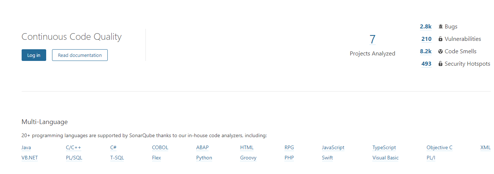

## sonar代码分析及插件集成

### 本地sonarqube安装

最方便的方式是基于docker安装

[ dockerhub的官方镜像地址](https://hub.docker.com/_/sonarqube)

```shell
docker run -d --name sonarqube \
  -p 9000:9000 \
  -v $SONARQUBE_HOME/conf:/opt/sonarqube/conf \
  -v $SONARQUBE_HOME/extensions:/opt/sonarqube/extensions \
  -v $SONARQUBE_HOME/logs:/opt/sonarqube/logs \
  -v $SONARQUBE_HOME/data:/opt/sonarqube/data \
  sonarqube
```



启动后使用admin:admin进行登陆，

### 集成方式

#### IDEA插件

#### MAVEN

[maven集成sonar官方文档](https://docs.sonarqube.org/latest/analysis/scan/sonarscanner-for-maven/)

[示例配置项目](https://github.com/SonarSource/sonar-scanning-examples)

在项目对应的目录执行:

```shell
mvn sonar:sonar -Dsonar.host.url=http://$(boot2docker ip):9000
```

在 `$MAVEN_HOME/conf`或者`~/.m2`目录 配置maven的setting.xml 

```xml
<settings>
    <pluginGroups>
        <pluginGroup>org.sonarsource.scanner.maven</pluginGroup>
    </pluginGroups>
    <profiles>
        <profile>
            <id>sonar</id>
            <activation>
                <activeByDefault>true</activeByDefault>
            </activation>
            <properties>
                <!-- Optional URL to server. Default value is http://localhost:9000 -->
                <sonar.host.url>
                  http://myserver:9000
                </sonar.host.url>
            </properties>
        </profile>
     </profiles>
</settings>
```

在命令行执行:

```shell
mvn clean verify sonar:sonar # normal情况
mvn sonar:sonar
mvn org.sonarsource.scanner.maven:sonar-maven-plugin:3.6.0.1398:sonar #指定sonar版本
# <sonar.skip>true</sonar.skip>  可以在pom.xml里面指定
# export MAVEN_OPTS="-Xmx512m" 指定运行时内存
```

通过maven插件配置:

```xml
<build>
  <pluginManagement>
    <plugins>
      <plugin>
        <groupId>org.sonarsource.scanner.maven</groupId>
        <artifactId>sonar-maven-plugin</artifactId>
        <version>3.6.0.1398</version>
      </plugin>
    </plugins>
  </pluginManagement>
</build>
```

配置扫描

```xml
 < properties> 
< project.build.sourceEncoding> UTF-8< /project.build.sourceEncoding> 
< sonar.host.url> http：//www.example.com/< /sonar.host.url> 
< sonar.jdbc.url> jdbc：postgresql：//www.example.com/sonar< /sonar.jdbc.url> 
< sonar.jdbc.driver> org.postgresql.Driver< /sonar.jdbc.driver> 
< sonar.jdbc.username> sonar< /sonar.jdbc.username> 
< sonar.jdbc.password> sonar< /sonar.jdbc.password> 
< sonar.exclusions> org / binarytherapy / generated / ** / *，** / GuiceBindComposer.java< /sonar.exclusions> 
< sonar.dynamic> reuseReports< /sonar.dynamic>
< / properties> 
```

#### JENKINS

[集成案例](https://funnelgarden.com/sonarqube-jenkins-docker/)

[集成官方文档](https://docs.sonarqube.org/latest/analysis/scan/sonarscanner-for-jenkins/)

#### GRADLE

[集成官方文档](https://docs.sonarqube.org/latest/analysis/scan/sonarscanner-for-gradle/)